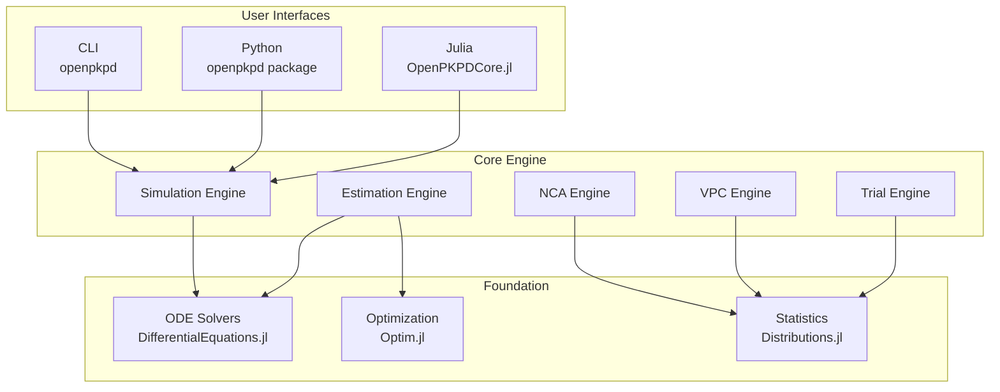
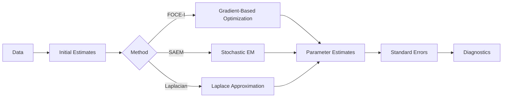
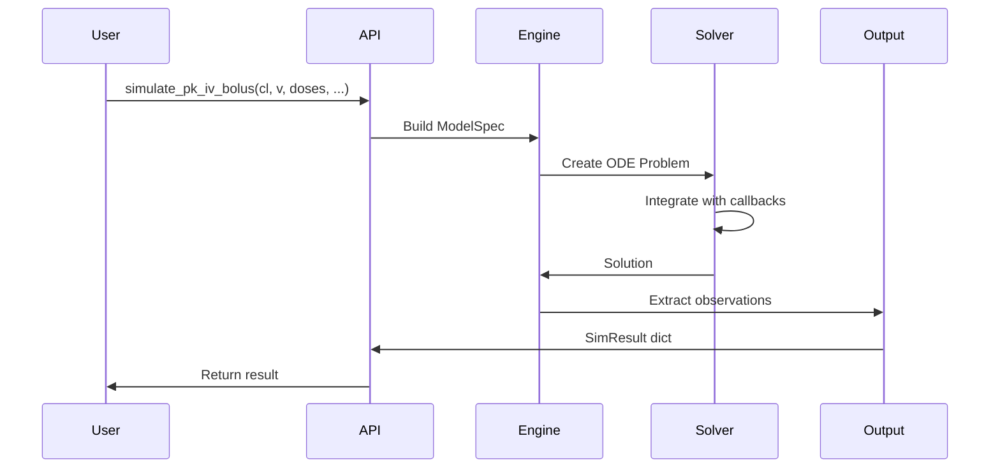
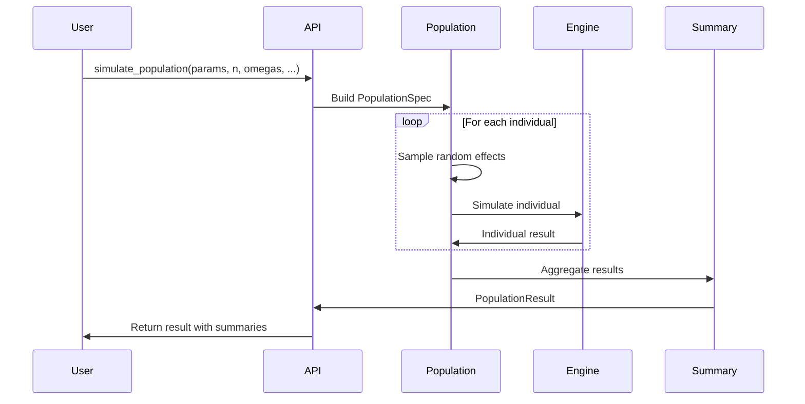

# Architecture Overview

OpenPKPD is designed as a modular, multi-language platform with a high-performance Julia core and accessible Python bindings.

---

## System Architecture



---

## Package Structure

```
openpkpd/
├── core/                          # Julia core library
│   └── OpenPKPDCore/
│       ├── src/
│       │   ├── OpenPKPDCore.jl    # Main module
│       │   ├── engine/            # Simulation engines
│       │   │   ├── simulation.jl
│       │   │   ├── population.jl
│       │   │   └── covariates.jl
│       │   ├── models/            # PK/PD model definitions
│       │   │   ├── pk/
│       │   │   └── pd/
│       │   ├── estimation/        # NLME estimation
│       │   │   ├── foce.jl
│       │   │   ├── saem.jl
│       │   │   └── laplacian.jl
│       │   ├── nca/               # Non-compartmental analysis
│       │   ├── vpc/               # Visual predictive checks
│       │   ├── trial/             # Clinical trial simulation
│       │   ├── import/            # NONMEM/Monolix parsers
│       │   ├── serialization/     # JSON artifact I/O
│       │   └── specs/             # Type specifications
│       └── test/                  # Comprehensive test suite
│
├── packages/
│   ├── python/                    # Python bindings
│   │   └── openpkpd/
│   │       ├── __init__.py        # Core simulation functions
│   │       ├── nca/               # NCA module
│   │       ├── trial/             # Trial simulation module
│   │       ├── viz/               # Visualization (55+ functions)
│   │       └── data/              # Data import utilities
│   │
│   └── cli/                       # Command-line interface
│       └── bin/openpkpd           # CLI executable
│
├── validation/                    # Reproducibility validation
│   ├── golden/                    # Golden reference artifacts
│   └── scripts/                   # Validation scripts
│
└── docs/                          # Documentation (this site)
```

---

## Core Components

### Simulation Engine

The simulation engine handles ODE-based PK/PD model execution:

```julia
# Core simulation flow
function simulate(spec::ModelSpec, grid::SimGrid, solver::SolverSpec)
    # 1. Build ODE problem
    prob = build_ode_problem(spec)

    # 2. Add dose callbacks
    callbacks = build_dose_callbacks(spec.doses, grid)

    # 3. Solve ODE system
    sol = solve(prob, solver.alg;
                reltol=solver.reltol,
                abstol=solver.abstol,
                callback=callbacks,
                saveat=grid.saveat)

    # 4. Extract observations
    observations = compute_observations(sol, spec.model)

    return SimResult(sol.t, sol.u, observations)
end
```

**Key Features:**
- Automatic dose event handling (bolus, infusion)
- Flexible ODE solver selection
- State and observation extraction
- Full numerical precision

### Population Engine

Extends single-subject simulation to populations:

```julia
function simulate_population(pop_spec::PopulationSpec, grid, solver)
    individuals = Vector{SimResult}(undef, pop_spec.n)
    realized_params = Vector{Dict}(undef, pop_spec.n)

    for i in 1:pop_spec.n
        # Sample random effects
        eta = sample_random_effects(pop_spec.omega, pop_spec.seed + i)

        # Apply IIV to parameters
        params = apply_iiv(pop_spec.typical_params, eta)

        # Apply covariates if present
        if has_covariates(pop_spec)
            params = apply_covariates(params, pop_spec.covariates[i])
        end

        # Simulate individual
        individuals[i] = simulate(build_spec(params), grid, solver)
        realized_params[i] = params
    end

    # Compute population summaries
    summaries = compute_summaries(individuals)

    return PopulationResult(individuals, realized_params, summaries)
end
```

### Estimation Engine

NLME parameter estimation using FOCE-I, SAEM, or Laplacian:



### NCA Engine

Non-compartmental analysis following regulatory guidelines:

```julia
function run_nca(times, conc, dose; config=NCAConfig())
    # Exposure metrics
    cmax, tmax = find_cmax(times, conc)

    # AUC calculation
    auc_0_t = compute_auc(times, conc, config.method)

    # Terminal phase
    lambda_z, r2, n_points = estimate_lambda_z(times, conc, config)
    t_half = log(2) / lambda_z

    # Extrapolation
    auc_0_inf = auc_0_t + conc[end] / lambda_z

    # Clearance
    cl_f = dose / auc_0_inf
    vz_f = cl_f / lambda_z

    return NCAResult(cmax, tmax, auc_0_t, auc_0_inf, t_half, cl_f, vz_f, ...)
end
```

---

## Data Flow

### Single Simulation



### Population Simulation



---

## Type System

### Core Types (Julia)

```julia
# Model specification
struct ModelSpec{M<:ModelKind, P<:AbstractParams}
    model::M
    name::String
    params::P
    doses::Vector{DoseEvent}
end

# Simulation grid
struct SimGrid
    t0::Float64
    t1::Float64
    saveat::Vector{Float64}
end

# Solver configuration
struct SolverSpec
    alg::Symbol
    reltol::Float64
    abstol::Float64
    maxiters::Int
end

# Simulation result
struct SimResult
    t::Vector{Float64}
    states::Dict{Symbol, Vector{Float64}}
    observations::Dict{Symbol, Vector{Float64}}
    metadata::Dict{Symbol, Any}
end
```

### Python Type Mapping

| Julia Type | Python Type |
|------------|-------------|
| `Float64` | `float` |
| `Vector{Float64}` | `list[float]` |
| `Dict{Symbol, Any}` | `dict[str, Any]` |
| `SimResult` | `dict` with standard keys |
| `DoseEvent` | `dict` with `time`, `amount`, `duration` |

---

## Serialization

### Artifact Schema

All simulation results can be serialized to JSON artifacts:

```json
{
  "schema_version": "1.0.0",
  "artifact_type": "simulation",
  "created_at": "2024-01-15T10:30:00Z",
  "model": {
    "kind": "OneCompIVBolus",
    "params": {"CL": 5.0, "V": 50.0},
    "doses": [{"time": 0.0, "amount": 100.0, "duration": 0.0}]
  },
  "grid": {
    "t0": 0.0,
    "t1": 24.0,
    "saveat": [0.0, 1.0, 2.0, ...]
  },
  "solver": {
    "alg": "Tsit5",
    "reltol": 1e-10,
    "abstol": 1e-12,
    "maxiters": 10000000
  },
  "result": {
    "t": [0.0, 1.0, 2.0, ...],
    "observations": {
      "conc": [2.0, 1.81, 1.64, ...]
    }
  },
  "semantics": {
    "event_version": "1.0.0",
    "solver_version": "1.0.0"
  }
}
```

### Replay Capability

Artifacts can be replayed to reproduce exact results:

```bash
./bin/openpkpd replay --artifact simulation.json
```

---

## Extension Points

### Custom Models

Add new models by implementing the model interface:

```julia
# 1. Define model kind
struct MyCustomModel <: ModelKind end

# 2. Define parameters
struct MyCustomParams <: AbstractParams
    param1::Float64
    param2::Float64
end

# 3. Implement ODE function
function ode!(du, u, p::MyCustomParams, t)
    du[1] = -p.param1 * u[1]
end

# 4. Implement observation function
function observe(model::MyCustomModel, u, p)
    return Dict(:conc => u[1] / p.param2)
end
```

### Custom Visualization

Add new visualization functions following the pattern:

```python
def plot_my_custom(
    data: DataType,
    *,
    backend: str = "matplotlib",
    title: str | None = None,
    figsize: tuple[float, float] = (10, 6),
    **kwargs
) -> Figure:
    """Custom plot function."""
    backend_module = get_backend_module(backend)
    fig, ax = backend_module.create_figure(figsize)
    # ... plotting logic
    return fig
```

---

## Performance Considerations

### Julia JIT Compilation

First simulation incurs compilation overhead. Subsequent simulations are fast:

```julia
# First call: ~2-5 seconds (compilation)
@time simulate(spec, grid, solver)

# Subsequent calls: ~1-10 ms
@time simulate(spec, grid, solver)
```

### Python Bridge Overhead

The Python-Julia bridge adds minimal overhead (~1ms per call).

### Population Parallelization

Population simulations can be parallelized:

```julia
using Threads

Threads.@threads for i in 1:n
    individuals[i] = simulate(...)
end
```

---

## Next Steps

- [Getting Started](getting-started.md) - Installation and setup
- [Julia Tutorial](../julia/tutorial.md) - Deep dive into Julia API
- [Python Tutorial](../python/tutorial.md) - Python bindings walkthrough
