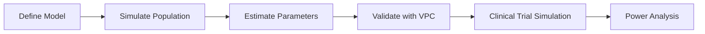

# Introduction to NeoPKPD

<div class="hero-section">
<h2>Transparent, Validated PK/PD Modeling Infrastructure</h2>
<p>NeoPKPD is an open-source platform for pharmacokinetic and pharmacodynamic modeling, built for reproducibility, scientific rigor, and regulatory compliance.</p>
</div>

---

## What is NeoPKPD?

NeoPKPD is a comprehensive pharmacometrics platform that provides:

- **Validated PK/PD Models** - Industry-standard compartmental models with full mathematical transparency
- **Population Simulation** - Inter-individual and inter-occasion variability modeling
- **Parameter Estimation** - FOCE-I, SAEM, and Laplacian methods for NLME estimation
- **Non-Compartmental Analysis** - FDA/EMA-compliant exposure metrics
- **Clinical Trial Simulation** - Virtual trial design and power analysis
- **Professional Visualization** - Publication-ready plots with dual backend support

## Why NeoPKPD?

### Transparency
Every model equation, algorithm, and numerical method is documented and open for inspection. No black boxes.

### Reproducibility
JSON-serialized artifacts capture complete simulation state, enabling bit-exact reproduction across versions and platforms.

### Dual-Language Support
Write your analysis in Julia for maximum performance, or Python for seamless integration with data science workflows.

### Regulatory-Ready
NCA calculations follow FDA/EMA guidelines. VPC and diagnostic plots meet regulatory submission standards.

---

## Quick Links

<div class="grid cards" markdown>

-   :simple-julia:{ .lg .middle } **Julia Documentation**

    ---

    Complete reference for the Julia core library

    [:octicons-arrow-right-24: Julia Docs](../julia/index.md)

-   :material-language-python:{ .lg .middle } **Python Documentation**

    ---

    Python bindings with visualization support

    [:octicons-arrow-right-24: Python Docs](../python/index.md)

-   :material-rocket-launch:{ .lg .middle } **Getting Started**

    ---

    Install NeoPKPD and run your first simulation

    [:octicons-arrow-right-24: Get Started](getting-started.md)

</div>

---

## Core Capabilities

### Pharmacokinetic Models

| Model | Compartments | Route | Key Application |
|-------|--------------|-------|-----------------|
| One-Compartment | 1 | IV/Oral | Simple kinetics |
| Two-Compartment | 2 | IV/Oral | Distribution phase |
| Three-Compartment | 3 | IV | Deep tissue binding |
| Transit Absorption | N+1 | Oral | Delayed absorption |
| Michaelis-Menten | 1 | IV | Saturable elimination |
| TMDD | 2-3 | IV | Target-mediated disposition |

### Pharmacodynamic Models

| Model | Type | Mechanism |
|-------|------|-----------|
| Direct Emax | Direct | Immediate response |
| Sigmoid Emax | Direct | Hill equation |
| Effect Compartment | Indirect | Biophase equilibration |
| Indirect Response (I-IV) | Indirect | Turnover modulation |
| Disease Progression | Complex | Biomarker dynamics |

### Analysis Workflows



---

## Platform Architecture

NeoPKPD is organized as a monorepo with three main packages:

```
neopkpd/
├── core/           # Julia core library (NeoPKPDCore.jl)
├── packages/
│   ├── python/     # Python bindings (neopkpd)
│   └── cli/        # Command-line interface
├── validation/     # Golden artifacts for reproducibility
└── docs/           # This documentation
```

[Learn more about the architecture →](architecture.md)

---

## Version Information

| Component | Version |
|-----------|---------|
| NeoPKPD | 0.1.0 |
| Event Semantics | 1.0.0 |
| Solver Semantics | 1.0.0 |
| Artifact Schema | 1.0.0 |

---

## Next Steps

<div class="grid cards" markdown>

-   **New to NeoPKPD?**

    Start with the [Getting Started Guide](getting-started.md)

-   **Coming from NONMEM?**

    See the [NONMEM Migration Guide](../examples/use_cases/nonmem_migration/README.md)

-   **Need visualization?**

    Check out [Python Visualization](../python/viz/index.md)

</div>
