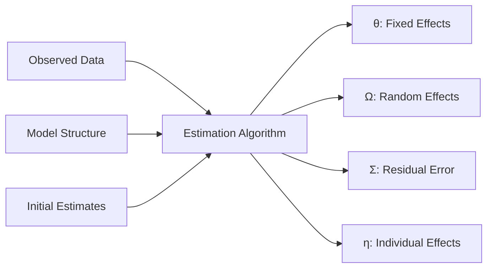

# Parameter Estimation

NeoPKPD provides nonlinear mixed-effects (NLME) estimation methods for fitting population PK/PD models to observed data.

---

## Overview

Parameter estimation determines the typical parameter values (θ), random effect variances (Ω), and residual error (Σ) that best describe observed data.



---

## Estimation Methods

<div class="grid cards" markdown>

-   :material-math-integral:{ .lg .middle } **FOCE-I**

    ---

    First-Order Conditional Estimation with Interaction

    [:octicons-arrow-right-24: FOCE-I](foce.md)

-   :material-dice-multiple:{ .lg .middle } **SAEM**

    ---

    Stochastic Approximation EM Algorithm

    [:octicons-arrow-right-24: SAEM](saem.md)

-   :material-function-variant:{ .lg .middle } **Laplacian**

    ---

    Laplace Approximation for Sparse Data

    [:octicons-arrow-right-24: Laplacian](laplacian.md)

-   :material-chart-box-outline:{ .lg .middle } **Diagnostics**

    ---

    Model fit assessment and validation

    [:octicons-arrow-right-24: Diagnostics](diagnostics.md)

-   :material-scale-balance:{ .lg .middle } **Model Comparison**

    ---

    AIC, BIC, likelihood ratio tests

    [:octicons-arrow-right-24: Comparison](comparison.md)

</div>

---

## Quick Start

### FOCE-I Estimation

```julia
using NeoPKPDCore

# Prepare observed data
data = EstimationData(
    ids = [1, 1, 1, 2, 2, 2, 3, 3, 3],
    times = [0.5, 2.0, 8.0, 0.5, 2.0, 8.0, 0.5, 2.0, 8.0],
    dv = [1.8, 1.2, 0.4, 2.1, 1.4, 0.5, 1.5, 1.0, 0.3],
    doses = [
        DoseEvent(0.0, 100.0),
        DoseEvent(0.0, 100.0),
        DoseEvent(0.0, 100.0)
    ],
    dose_ids = [1, 1, 1, 2, 2, 2, 3, 3, 3]
)

# Model specification
model = OneCompIVBolus()

# Initial parameter estimates
init = InitialEstimates(
    theta = [5.0, 50.0],          # CL, V
    omega = [0.09, 0.04],         # ω²_CL, ω²_V
    sigma = [0.01]                 # σ² (proportional)
)

# Configure FOCE
config = FOCEConfig(
    max_iterations = 1000,
    tolerance = 1e-6,
    compute_se = true
)

# Run estimation
result = estimate(data, model, init, config)

# Access results
println("θ (CL, V): ", result.theta)
println("SE: ", result.theta_se)
println("ω²: ", result.omega)
println("σ²: ", result.sigma)
println("OFV: ", result.ofv)
```

### SAEM Estimation

```julia
config = SAEMConfig(
    n_iterations = 500,
    n_burn_in = 100,
    n_chains = 3,
    step_size = 0.7
)

result = estimate(data, model, init, config)
```

---

## Method Comparison

| Feature | FOCE-I | SAEM | Laplacian |
|---------|--------|------|-----------|
| Speed | Fast | Moderate | Fast |
| Robustness | Good | Excellent | Good |
| Sparse Data | Fair | Good | Excellent |
| Complex Models | Fair | Excellent | Good |
| Standard Errors | Analytical | Bootstrap | Analytical |
| Local Minima | Risk | Low Risk | Risk |

### When to Use Each Method

**FOCE-I**: Default choice for most problems
- Well-behaved data
- Standard PK models
- Need analytical SE

**SAEM**: Complex or problematic datasets
- Highly nonlinear models
- Multimodal likelihood
- Many random effects

**Laplacian**: Sparse sampling
- Few observations per subject
- Time-to-event data
- Categorical outcomes

---

## Estimation Result Structure

```julia
struct EstimationResult
    # Parameter estimates
    theta::Vector{Float64}          # Fixed effects
    theta_se::Vector{Float64}       # Standard errors
    theta_rse::Vector{Float64}      # Relative SE (%)
    theta_ci::Matrix{Float64}       # 95% CI

    # Random effects
    omega::Matrix{Float64}          # Variance-covariance
    omega_se::Matrix{Float64}

    # Residual error
    sigma::Vector{Float64}
    sigma_se::Vector{Float64}

    # Individual estimates
    etas::Matrix{Float64}           # EBEs (n × p)
    ipred::Vector{Float64}          # Individual predictions

    # Diagnostics
    ofv::Float64                    # Objective function value
    aic::Float64                    # Akaike Information Criterion
    bic::Float64                    # Bayesian IC

    # Convergence
    converged::Bool
    n_iterations::Int
    gradient::Vector{Float64}

    # Metadata
    method::Symbol
    runtime::Float64
end
```

---

## Model Diagnostics

### Goodness of Fit

```julia
# Predictions
pred = result.pred       # Population predictions
ipred = result.ipred     # Individual predictions

# Residuals
cwres = result.cwres     # Conditional weighted residuals
iwres = result.iwres     # Individual weighted residuals
npde = result.npde       # Normalized prediction distribution errors
```

### Shrinkage

Eta shrinkage indicates information content:

$$\text{Shrinkage}_\eta = 1 - \frac{SD(\hat{\eta})}{SD(\eta)}$$

```julia
shrinkage = compute_shrinkage(result)
println("CL shrinkage: ", shrinkage[1] * 100, "%")
println("V shrinkage: ", shrinkage[2] * 100, "%")
```

High shrinkage (>30%) suggests limited information for individual parameters.

---

## Objective Function

The FOCE-I objective function:

$$OFV = \sum_i \left[ \ln|C_i| + (y_i - f_i)^T C_i^{-1} (y_i - f_i) \right]$$

Where:
- $C_i$ = Individual covariance matrix
- $y_i$ = Observations
- $f_i$ = Model predictions

---

## Next Steps

- [FOCE-I Details](foce.md) - Deep dive into FOCE algorithm
- [SAEM Details](saem.md) - Stochastic approximation
- [Diagnostics](diagnostics.md) - Model validation
- [Model Comparison](comparison.md) - AIC, BIC, LRT
