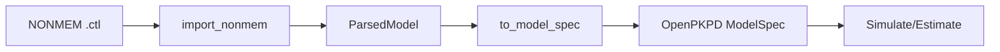

# Model Import

OpenPKPD can import models from other pharmacometrics platforms, enabling migration and interoperability.

---

## Supported Formats

<div class="grid cards" markdown>

-   :material-file-code:{ .lg .middle } **NONMEM**

    ---

    Parse NONMEM control stream files (.ctl, .mod)

    [:octicons-arrow-right-24: NONMEM Import](nonmem.md)

-   :material-file-document:{ .lg .middle } **Monolix**

    ---

    Parse Monolix project files (.mlxtran)

    [:octicons-arrow-right-24: Monolix Import](monolix.md)

-   :material-database:{ .lg .middle } **CDISC Data**

    ---

    Import CDISC/SDTM formatted data

    [:octicons-arrow-right-24: CDISC Import](cdisc.md)

</div>

---

## NONMEM Import

### Supported Features

| Feature | Support | Notes |
|---------|---------|-------|
| ADVAN1 (1-comp IV) | ✅ Full | Direct mapping |
| ADVAN2 (1-comp oral) | ✅ Full | Ka, CL, V |
| ADVAN3 (2-comp IV) | ✅ Full | CL, V1, Q, V2 |
| ADVAN4 (2-comp oral) | ✅ Full | Ka, CL, V1, Q, V2 |
| ADVAN11 (3-comp IV) | ✅ Full | Full three-comp |
| ADVAN12 (3-comp oral) | ✅ Full | With absorption |
| TRANS parameters | ✅ Full | TRANS1-4 |
| $THETA | ✅ Full | Fixed effects |
| $OMEGA | ✅ Full | Random effects |
| $SIGMA | ✅ Full | Residual error |
| $ERROR | ⚠️ Partial | Common patterns |
| $PK | ⚠️ Partial | Standard code |

### Quick Start

```julia
using OpenPKPDCore

# Import NONMEM control stream
model = import_nonmem("run001.ctl")

# Access parsed components
println("Model type: ", model.advan)
println("THETA: ", model.theta)
println("OMEGA: ", model.omega)

# Convert to OpenPKPD ModelSpec
spec = to_model_spec(model)
```

### CLI Usage

```bash
./bin/openpkpd import --input run001.ctl --format nonmem --out model.json
```

---

## Monolix Import

### Supported Features

| Feature | Support |
|---------|---------|
| Structural models | ✅ Full |
| Parameter definitions | ✅ Full |
| Random effects | ✅ Full |
| Covariate models | ⚠️ Partial |
| Error models | ✅ Full |

### Quick Start

```julia
# Import Monolix project
model = import_monolix("project.mlxtran")

# Convert to OpenPKPD
spec = to_model_spec(model)
```

---

## CDISC Data Import

### Supported Domains

| Domain | Description | Support |
|--------|-------------|---------|
| PC | Pharmacokinetic Concentrations | ✅ Full |
| EX | Exposure (Dosing) | ✅ Full |
| DM | Demographics | ✅ Full |
| VS | Vital Signs | ⚠️ Partial |
| LB | Laboratory | ⚠️ Partial |

### Quick Start

```julia
# Import CDISC data
data = import_cdisc(
    pc_path = "pc.csv",
    ex_path = "ex.csv",
    dm_path = "dm.csv",
    format = :csv           # or :xpt for SAS transport
)

# Access standardized data
println("Subjects: ", length(unique(data.usubjid)))
println("Observations: ", length(data.dv))
```

### Data Structure

```julia
struct CDISCData
    # Subject identifiers
    usubjid::Vector{String}
    subjid::Vector{Int}

    # Time and observations
    times::Vector{Float64}
    dv::Vector{Float64}

    # Dosing
    doses::Vector{DoseEvent}
    dose_times::Vector{Float64}
    dose_amounts::Vector{Float64}

    # Demographics
    age::Vector{Float64}
    sex::Vector{Symbol}
    weight::Vector{Float64}

    # Metadata
    study::String
    analyte::String
end
```

---

## Migration Workflow

### NONMEM to OpenPKPD



### Step-by-Step

1. **Parse control stream**
```julia
parsed = import_nonmem("run001.ctl")
```

2. **Review parsed model**
```julia
println("ADVAN: ", parsed.advan)
println("Parameters: ", parsed.theta)
println("Random effects: ", parsed.omega)
```

3. **Convert to OpenPKPD**
```julia
spec = to_model_spec(parsed)
```

4. **Validate with simulation**
```julia
result = simulate(spec, grid, solver)
```

5. **Compare to NONMEM output**
```julia
# Load NONMEM predictions
nm_pred = load_nonmem_output("run001.tab")

# Compare
@assert isapprox(result.observations[:conc], nm_pred.IPRED, rtol=0.01)
```

---

## Limitations

### NONMEM

- Custom $PK/$ERROR blocks may not parse correctly
- User-defined ADVAN/TRANS not supported
- Complex conditional logic requires manual conversion

### Monolix

- Custom structural models need adaptation
- Some advanced features may not translate

### Workarounds

For unsupported features:

1. Simplify the NONMEM code before import
2. Manually define the OpenPKPD model
3. Use the CLI `--validate` flag to check import accuracy

---

## Next Steps

- [NONMEM Details](nonmem.md) - Complete NONMEM import guide
- [Monolix Details](monolix.md) - Monolix project import
- [CDISC Details](cdisc.md) - CDISC data format support
