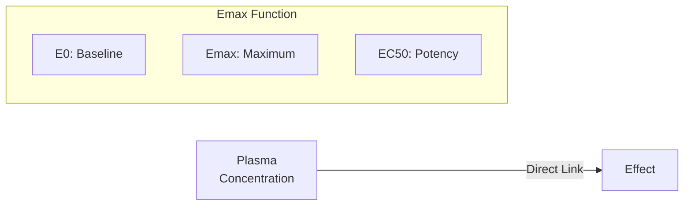

# Direct Emax Model

Simple hyperbolic concentration-effect relationship where effect is directly proportional to receptor occupancy.

---

## Model Overview



### Clinical Applications

- Simple receptor-mediated effects
- Anticoagulants (warfarin effect on INR)
- Beta-blockers (heart rate reduction)
- Enzyme inhibitors
- Rapid-equilibrium systems

### When to Use

| Use When | Don't Use When |
|----------|----------------|
| Effect tracks concentration | Temporal delay observed |
| Rapid equilibration | Hysteresis present |
| Simple dose-response | Tolerance develops |
| Reversible binding | Effect persists after drug |

---

## Mathematical Formulation

### Parameters

| Parameter | Symbol | Units | Description | Constraints |
|-----------|--------|-------|-------------|-------------|
| Baseline effect | E0 | varies | Effect with no drug | any real |
| Maximum effect | Emax | varies | Maximum drug-induced change | typically > 0 |
| Half-maximal concentration | EC50 | mg/L | Concentration at 50% Emax | EC50 > 0 |

### Equation

$$E(C) = E_0 + \frac{E_{max} \cdot C}{EC_{50} + C}$$

### Fraction of Maximum Effect

At any concentration:

$$\frac{E - E_0}{E_{max}} = \frac{C}{EC_{50} + C}$$

### Key Concentrations

| Fraction of Emax | Concentration Required |
|------------------|------------------------|
| 20% | C = EC50/4 |
| 50% | C = EC50 |
| 80% | C = EC50 × 4 |
| 90% | C = EC50 × 9 |
| 99% | C = EC50 × 99 |

---

## Model Behavior

### Concentration-Effect Curve

```
Effect
   │
Emax├─────────────────────────────
    │                     ┌──────
    │                  ┌──┘
    │               ┌──┘
    │            ┌──┘
    │         ┌──┘
E0+½├ ─ ─ ─ ┬┘
    │       │
 E0 ├───────┴─────────────────────
    └───────┼─────────────────────→ C
          EC50
```

### Key Properties

1. **Hyperbolic shape**: Effect increases rapidly at low C, plateaus at high C
2. **Saturable**: Effect cannot exceed E0 + Emax
3. **First-order at low C**: When C << EC50, E ≈ E0 + (Emax/EC50) × C
4. **Zero-order at high C**: When C >> EC50, E ≈ E0 + Emax

---

## Julia API

### Type Definitions

```julia
# Model kind
struct DirectEmax <: PDModelKind end

# Parameters
struct DirectEmaxParams
    E0::Float64      # Baseline effect
    Emax::Float64    # Maximum effect
    EC50::Float64    # Half-maximal concentration (mg/L)
end
```

### Basic Usage

```julia
using NeoPKPDCore

# Define PD parameters
# E0 = 70 (baseline), Emax = 40 (reduction), EC50 = 1.5 mg/L
pd_params = DirectEmaxParams(70.0, -40.0, 1.5)

# Create PD specification
pd_spec = PDSpec(DirectEmax(), "heart_rate", pd_params)

# Evaluate at specific concentrations
concentrations = [0.0, 0.5, 1.0, 1.5, 2.0, 3.0, 5.0]
effects = evaluate(pd_spec, concentrations)

for (c, e) in zip(concentrations, effects)
    println("C = $c mg/L: Effect = $(round(e, digits=1))")
end
```

**Expected Output:**
```
C = 0.0 mg/L: Effect = 70.0
C = 0.5 mg/L: Effect = 60.0
C = 1.0 mg/L: Effect = 54.0
C = 1.5 mg/L: Effect = 50.0
C = 2.0 mg/L: Effect = 47.1
C = 3.0 mg/L: Effect = 43.3
C = 5.0 mg/L: Effect = 39.2
```

---

## Coupled PK-PD Simulation

```julia
using NeoPKPDCore

# PK model: One-compartment oral
pk_params = OneCompOralFirstOrderParams(1.5, 5.0, 30.0)  # Ka, CL, V
pk_spec = ModelSpec(OneCompOralFirstOrder(), "pk", pk_params, [DoseEvent(0.0, 100.0)])

# PD model: Direct Emax (inhibitory)
pd_params = DirectEmaxParams(80.0, -30.0, 2.0)  # Baseline HR, max reduction, EC50
pd_spec = PDSpec(DirectEmax(), "heart_rate", pd_params)

# Simulation grid
grid = SimGrid(0.0, 24.0, collect(0.0:0.25:24.0))
solver = SolverSpec(:Tsit5, 1e-10, 1e-12, 10_000_000)

# Simulate PK
pk_result = simulate(pk_spec, grid, solver)
conc = pk_result.observations[:conc]

# Calculate PD effect
effects = evaluate(pd_spec, conc)

# Find minimum heart rate (maximum effect)
min_hr, idx = findmin(effects)
time_of_min = grid.times[idx]

println("Maximum effect at t = $(round(time_of_min, digits=1)) h")
println("Heart rate reduced to $(round(min_hr, digits=1)) bpm")
```

---

## Parameter Interpretation

### Potency vs Efficacy

| Parameter | Meaning | Clinical Relevance |
|-----------|---------|-------------------|
| EC50 | **Potency** - concentration for 50% effect | Lower EC50 = more potent drug |
| Emax | **Efficacy** - maximum possible effect | Higher Emax = more efficacious |

### Comparing Drugs

```julia
# Drug A: High potency, moderate efficacy
params_A = DirectEmaxParams(0.0, 80.0, 0.5)

# Drug B: Low potency, high efficacy
params_B = DirectEmaxParams(0.0, 100.0, 5.0)

# At low concentration (1 mg/L):
# Drug A: E = 80 × 1/(0.5+1) = 53.3
# Drug B: E = 100 × 1/(5+1) = 16.7
# Drug A wins at low concentrations

# At high concentration (10 mg/L):
# Drug A: E = 80 × 10/(0.5+10) ≈ 76.2
# Drug B: E = 100 × 10/(5+10) = 66.7
# Drug A still higher but closer
```

---

## Clinical Example: Beta-Blocker

```julia
# Propranolol effect on heart rate
# Baseline HR: 80 bpm
# Max reduction: 30 bpm
# EC50: 50 ng/mL

pd_params = DirectEmaxParams(80.0, -30.0, 0.050)  # EC50 in mg/L

# Target: HR reduction of 15 bpm (half of max effect)
# Required C = EC50 = 0.050 mg/L = 50 ng/mL

# Verify
spec = PDSpec(DirectEmax(), "hr", pd_params)
effect_at_ec50 = evaluate(spec, [0.050])[1]
println("HR at EC50: $(round(effect_at_ec50, digits=1)) bpm")
# Expected: 80 - 15 = 65 bpm
```

---

## Stimulatory vs Inhibitory Effects

### Inhibitory Effect (Emax < 0)

```julia
# Drug reduces blood pressure
# E0 = baseline, Emax = negative (reduction)
pd_inhibit = DirectEmaxParams(140.0, -40.0, 2.0)

# Effect range: 140 → 100 mmHg
```

### Stimulatory Effect (Emax > 0)

```julia
# Drug increases enzyme activity
# E0 = baseline, Emax = positive (increase)
pd_stimulate = DirectEmaxParams(100.0, 200.0, 5.0)

# Effect range: 100 → 300 units
```

---

## Model Limitations

| Limitation | Alternative |
|------------|-------------|
| No delay between C and E | Use Effect Compartment model |
| Fixed steepness | Use Sigmoid Emax (add Hill coefficient) |
| No tolerance | Use Indirect Response models |
| Symmetric curve | Use more complex models |

---

## Derived Quantities

### Sensitivity (Slope at Origin)

$$\text{Sensitivity} = \frac{dE}{dC}\bigg|_{C=0} = \frac{E_{max}}{EC_{50}}$$

### Therapeutic Window

If target effect range is E1 to E2:

$$C_1 = EC_{50} \cdot \frac{E_1 - E_0}{E_{max} - (E_1 - E_0)}$$

$$C_2 = EC_{50} \cdot \frac{E_2 - E_0}{E_{max} - (E_2 - E_0)}$$

---

## Equations Summary

| Quantity | Formula |
|----------|---------|
| Effect | $E_0 + E_{max} \cdot C / (EC_{50} + C)$ |
| Fraction of Emax | $C / (EC_{50} + C)$ |
| C for target effect | $EC_{50} \cdot (E - E_0) / (E_{max} - (E - E_0))$ |
| Sensitivity | $E_{max} / EC_{50}$ |

---

## See Also

- [Sigmoid Emax Model](sigmoid-emax.md) - Variable steepness
- [Effect Compartment Model](effect-compartment.md) - With temporal delay
- [Indirect Response Models](indirect-response.md) - Mechanism-based
- [PKPD Coupling](../../population/index.md) - Population PKPD
