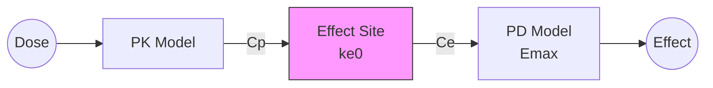

# Effect Compartment (Biophase) Model

Hypothetical effect site compartment to model temporal delays between plasma concentration and pharmacodynamic effect.

---

## Model Overview



### Clinical Applications

- Anesthetics (propofol, remifentanil)
- Neuromuscular blocking agents
- CNS-active drugs
- Any drug showing hysteresis
- Delayed onset/offset effects
- Drugs crossing blood-brain barrier

### When to Use

| Use When | Don't Use When |
|----------|----------------|
| Counter-clockwise hysteresis | Effect tracks concentration |
| Delayed onset of effect | Rapid equilibration (ke0 >> k) |
| Effect persists after Cp drops | Clockwise hysteresis (tolerance) |
| Site-of-action differs from plasma | Simple concentration-effect |

---

## Hysteresis Explained

### Counter-Clockwise Hysteresis

When plotting Effect vs. Concentration:

```
Effect
   │     ╭─→─╮ absorption/distribution phase
   │    ↗    ↘
   │   │      │
   │  ╱        ╲ elimination phase
   │ ╱          ╲
   │╱            ╰─→─
   └────────────────→ Concentration
```

**Cause**: Effect site concentration lags behind plasma concentration.

---

## Mathematical Formulation

### Parameters

| Parameter | Symbol | Units | Description | Constraints |
|-----------|--------|-------|-------------|-------------|
| Effect site rate | ke0 | 1/h | Equilibration rate constant | ke0 > 0 |
| Baseline effect | E0 | varies | Effect with no drug | any real |
| Maximum effect | Emax | varies | Maximum change from baseline | typically > 0 |
| Effect site EC50 | EC50 | mg/L | Ce at 50% Emax | EC50 > 0 |

### Effect Site Dynamics

$$\frac{dC_e}{dt} = k_{e0} \cdot (C_p - C_e)$$

Where:
- Ce = Effect site concentration
- Cp = Plasma concentration
- ke0 = Equilibration rate constant

### Effect Calculation

Using Direct Emax on effect site concentration:

$$E(C_e) = E_0 + \frac{E_{max} \cdot C_e}{EC_{50} + C_e}$$

### Key Derived Parameters

| Parameter | Formula | Meaning |
|-----------|---------|---------|
| t1/2,ke0 | ln(2)/ke0 | Equilibration half-life |
| t90 | ln(10)/ke0 | Time to 90% equilibration |

---

## Julia API

### Type Definitions

```julia
# Model kind
struct BiophaseEquilibration <: PDModelKind end

# Parameters
struct BiophaseEquilibrationParams
    ke0::Float64     # Effect site equilibration rate (1/h)
    E0::Float64      # Baseline effect
    Emax::Float64    # Maximum effect
    EC50::Float64    # Effect site EC50 (mg/L)
end
```

### Basic Simulation

```julia
using NeoPKPD

# PK Model: One-compartment IV bolus
pk_params = OneCompIVBolusParams(5.0, 20.0)  # CL, V
doses = [DoseEvent(0.0, 200.0)]

pk_spec = ModelSpec(OneCompIVBolus(), "pk", pk_params, doses)

# Effect compartment PD parameters
# ke0 = 0.5/h gives t1/2,ke0 = 1.4 h
pd_params = BiophaseEquilibrationParams(0.5, 0.0, 100.0, 5.0)

# Simulation grid
grid = SimGrid(0.0, 12.0, collect(0.0:0.1:12.0))
solver = SolverSpec(:Tsit5, 1e-10, 1e-12, 10_000_000)

# Simulate PK
pk_result = simulate(pk_spec, grid, solver)
Cp = pk_result.observations[:conc]
t = pk_result.t

# Simulate effect compartment
Ce, effects = simulate_biophase(t, Cp, pd_params, solver)

# Compare Cp and Ce
println("Time to Cp max: 0.0 h (IV bolus)")
Ce_max, idx = findmax(Ce)
println("Time to Ce max: $(round(t[idx], digits=2)) h")
println("Delay due to effect compartment: $(round(t[idx], digits=2)) h")
```

---

## Effect of ke0 on Response

```julia
using NeoPKPD

# Same PK for all
pk_params = OneCompIVBolusParams(5.0, 20.0)
doses = [DoseEvent(0.0, 200.0)]
pk_spec = ModelSpec(OneCompIVBolus(), "pk", pk_params, doses)

grid = SimGrid(0.0, 12.0, collect(0.0:0.05:12.0))
solver = SolverSpec(:Tsit5, 1e-10, 1e-12, 10_000_000)

pk_result = simulate(pk_spec, grid, solver)
Cp = pk_result.observations[:conc]
t = pk_result.t

# Different ke0 values
ke0_values = [0.2, 0.5, 1.0, 2.0, 5.0]

for ke0 in ke0_values
    pd_params = BiophaseEquilibrationParams(ke0, 0.0, 100.0, 5.0)
    Ce, effects = simulate_biophase(t, Cp, pd_params, solver)

    _, idx_max = findmax(effects)
    t_max_effect = t[idx_max]
    t_half_eq = log(2) / ke0

    println("ke0=$ke0: t1/2,ke0=$(round(t_half_eq, digits=2)) h, ",
            "Tmax,effect=$(round(t_max_effect, digits=2)) h")
end
```

**Expected Pattern:**
- Higher ke0 → Faster equilibration → Earlier Tmax,effect
- Lower ke0 → Slower equilibration → More delayed Tmax,effect

---

## Clinical Example: Propofol Anesthesia

```julia
using NeoPKPD

# Propofol three-compartment PK (simplified to 2-comp)
# Parameters in per-minute
pk_params = TwoCompIVBolusParams(
    1.6 * 60,   # CL (L/h from L/min)
    4.3,        # V1 (L)
    2.3 * 60,   # Q (L/h)
    22.0        # V2 (L)
)

# 200 mg bolus
doses = [DoseEvent(0.0, 200.0)]
pk_spec = ModelSpec(TwoCompIVBolus(), "propofol", pk_params, doses)

# Effect compartment
# ke0 ≈ 0.26/min = 15.6/h for propofol
pd_params = BiophaseEquilibrationParams(
    15.6,      # ke0 (1/h)
    0.0,       # E0 (awake = 0)
    100.0,     # Emax (deep anesthesia = 100)
    3.0        # EC50 (mcg/mL = mg/L)
)

# Fine time grid (first 30 minutes)
grid = SimGrid(0.0, 0.5, collect(0.0:0.01:0.5))
solver = SolverSpec(:Tsit5, 1e-10, 1e-12, 10_000_000)

pk_result = simulate(pk_spec, grid, solver)
Cp = pk_result.observations[:conc]
t = pk_result.t

Ce, depth = simulate_biophase(t, Cp, pd_params, solver)

# Time to loss of consciousness (effect > 50)
loc_idx = findfirst(d -> d > 50, depth)
if loc_idx !== nothing
    println("Time to LOC: $(round(t[loc_idx] * 60, digits=1)) seconds")
end
```

---

## Comparing Direct vs Effect Compartment

```julia
using NeoPKPD

# PK: One-compartment oral
pk_params = OneCompOralFirstOrderParams(2.0, 5.0, 30.0)
doses = [DoseEvent(0.0, 100.0)]
pk_spec = ModelSpec(OneCompOralFirstOrder(), "pk", pk_params, doses)

grid = SimGrid(0.0, 24.0, collect(0.0:0.1:24.0))
solver = SolverSpec(:Tsit5, 1e-10, 1e-12, 10_000_000)

pk_result = simulate(pk_spec, grid, solver)
Cp = pk_result.observations[:conc]
t = pk_result.t

# Direct Emax (no delay)
pd_direct = DirectEmaxParams(0.0, 100.0, 3.0)
spec_direct = PDSpec(DirectEmax(), "direct", pd_direct)
effects_direct = evaluate(spec_direct, Cp)

# Effect compartment (with delay)
pd_biophase = BiophaseEquilibrationParams(0.3, 0.0, 100.0, 3.0)
Ce, effects_biophase = simulate_biophase(t, Cp, pd_biophase, solver)

# Compare Tmax
_, idx_direct = findmax(effects_direct)
_, idx_biophase = findmax(effects_biophase)

println("Direct Emax: Tmax,effect = $(round(t[idx_direct], digits=2)) h")
println("Effect Compartment: Tmax,effect = $(round(t[idx_biophase], digits=2)) h")
println("Delay: $(round(t[idx_biophase] - t[idx_direct], digits=2)) h")
```

---

## Steady State Considerations

At steady state, Ce = Cp (no hysteresis observable).

```julia
# Multiple dosing - hysteresis diminishes over time
doses = [DoseEvent(i * 8.0, 100.0) for i in 0:6]  # Q8H for 2 days

pk_params = OneCompOralFirstOrderParams(1.5, 5.0, 30.0)
pk_spec = ModelSpec(OneCompOralFirstOrder(), "pk", pk_params, doses)

grid = SimGrid(0.0, 56.0, collect(0.0:0.25:56.0))
solver = SolverSpec(:Tsit5, 1e-10, 1e-12, 10_000_000)

pk_result = simulate(pk_spec, grid, solver)
Cp = pk_result.observations[:conc]
t = pk_result.t

pd_params = BiophaseEquilibrationParams(0.5, 0.0, 100.0, 3.0)
Ce, effects = simulate_biophase(t, Cp, pd_params, solver)

# Compare Ce/Cp ratio over time
# Early: Ce lags Cp
# Late: Ce ≈ Cp at all times
for check_time in [4.0, 28.0, 52.0]
    idx = findfirst(x -> x >= check_time, t)
    ratio = Ce[idx] / Cp[idx]
    println("At t=$check_time h: Ce/Cp = $(round(ratio, digits=3))")
end
```

---

## Parameter Interpretation

### Equilibration Half-Life

| t1/2,ke0 | Implication |
|----------|-------------|
| < 10 min | Negligible delay, use Direct Emax |
| 10-60 min | Moderate delay, effect compartment needed |
| > 1 hour | Significant hysteresis |

### Choosing Between Models

```julia
# Rule of thumb:
# If t1/2,ke0 < elimination t1/2 / 10, use Direct Emax
# Otherwise, use Effect Compartment

function recommend_model(ke0, kel)
    t_half_ke0 = log(2) / ke0
    t_half_kel = log(2) / kel

    if t_half_ke0 < t_half_kel / 10
        println("Recommend: Direct Emax (fast equilibration)")
    else
        println("Recommend: Effect Compartment (significant delay)")
    end

    println("  t1/2,ke0 = $(round(t_half_ke0, digits=2)) h")
    println("  t1/2,kel = $(round(t_half_kel, digits=2)) h")
end

# Example
recommend_model(5.0, 0.5)   # Fast ke0
recommend_model(0.2, 0.5)   # Slow ke0
```

---

## Equations Summary

| Quantity | Formula |
|----------|---------|
| dCe/dt | $k_{e0} \cdot (C_p - C_e)$ |
| Effect | $E_0 + E_{max} \cdot C_e / (EC_{50} + C_e)$ |
| t1/2,ke0 | $\ln(2) / k_{e0}$ |
| t90% equilibration | $\ln(10) / k_{e0}$ |
| Steady state | $C_e = C_p$ |

---

## See Also

- [Direct Emax Model](direct-emax.md) - Without delay
- [Sigmoid Emax Model](sigmoid-emax.md) - Variable steepness
- [Indirect Response Models](indirect-response.md) - Mechanism-based
- [Population Modeling](../../population/index.md) - Population PKPD
