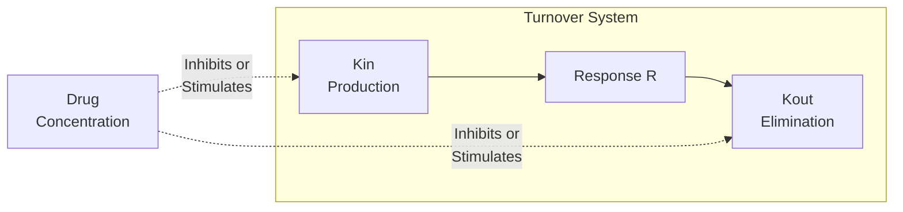

# Indirect Response Models (IRM)

Mechanism-based PD models where drug affects the production (Kin) or elimination (Kout) of a response variable, rather than directly modulating the response.

---

## Model Overview



### The Four IRM Types

| Model | Target | Direction | Effect on R |
|-------|--------|-----------|-------------|
| IRM-I | Kin (production) | Inhibition | Decreases R |
| IRM-II | Kin (production) | Stimulation | Increases R |
| IRM-III | Kout (elimination) | Inhibition | Increases R |
| IRM-IV | Kout (elimination) | Stimulation | Decreases R |

### Clinical Applications

| IRM Type | Example Applications |
|----------|---------------------|
| IRM-I | Corticosteroids (cortisol), Statins (cholesterol), Warfarin (clotting factors) |
| IRM-II | EPO (RBC production), G-CSF (neutrophils), Growth factors |
| IRM-III | Diuretics (renal function), Thyroid hormones (metabolism) |
| IRM-IV | Laxatives (bowel motility), Some immunosuppressants |

---

## Mathematical Formulation

### Baseline Turnover

At baseline (no drug):

$$\frac{dR}{dt} = K_{in} - K_{out} \cdot R = 0$$

Therefore: $R_0 = K_{in} / K_{out}$

### Drug Functions

**Inhibition function** (for IRM-I, IRM-III):

$$I(C) = \frac{I_{max} \cdot C}{IC_{50} + C}$$

**Stimulation function** (for IRM-II, IRM-IV):

$$S(C) = \frac{S_{max} \cdot C}{SC_{50} + C}$$

### IRM Equations

| Model | Differential Equation |
|-------|----------------------|
| IRM-I | $\frac{dR}{dt} = K_{in} \cdot (1 - I(C)) - K_{out} \cdot R$ |
| IRM-II | $\frac{dR}{dt} = K_{in} \cdot (1 + S(C)) - K_{out} \cdot R$ |
| IRM-III | $\frac{dR}{dt} = K_{in} - K_{out} \cdot (1 - I(C)) \cdot R$ |
| IRM-IV | $\frac{dR}{dt} = K_{in} - K_{out} \cdot (1 + S(C)) \cdot R$ |

---

## Parameters

### Common Parameters

| Parameter | Symbol | Units | Description | Constraints |
|-----------|--------|-------|-------------|-------------|
| Production rate | Kin | units/h | Zero-order production | Kin > 0 |
| Elimination rate | Kout | 1/h | First-order elimination | Kout > 0 |
| Baseline response | R0 | units | Steady-state baseline | R0 = Kin/Kout |

### Inhibition Parameters (IRM-I, IRM-III)

| Parameter | Symbol | Units | Description | Constraints |
|-----------|--------|-------|-------------|-------------|
| Maximum inhibition | Imax | - | Fraction at saturation | 0 < Imax ≤ 1 |
| Inhibition potency | IC50 | mg/L | Concentration for 50% Imax | IC50 > 0 |

### Stimulation Parameters (IRM-II, IRM-IV)

| Parameter | Symbol | Units | Description | Constraints |
|-----------|--------|-------|-------------|-------------|
| Maximum stimulation | Smax | - | Fold-increase at saturation | Smax > 0 |
| Stimulation potency | SC50 | mg/L | Concentration for 50% Smax | SC50 > 0 |

---

## Julia API

### Type Definitions

```julia
# IRM-I: Inhibition of Kin
struct IndirectResponseIRM1 <: PDModelKind end
struct IndirectResponseIRM1Params
    Kin::Float64      # Production rate
    Kout::Float64     # Elimination rate constant
    R0::Float64       # Baseline response
    Imax::Float64     # Maximum inhibition [0, 1]
    IC50::Float64     # Inhibition potency
end

# IRM-II: Stimulation of Kin
struct IndirectResponseIRM2 <: PDModelKind end
struct IndirectResponseIRM2Params
    Kin::Float64
    Kout::Float64
    R0::Float64
    Smax::Float64     # Maximum stimulation (can exceed 1)
    SC50::Float64     # Stimulation potency
end

# IRM-III: Inhibition of Kout (also known as IndirectResponseTurnover)
struct IndirectResponseTurnover <: PDModelKind end
struct IndirectResponseTurnoverParams
    Kin::Float64
    Kout::Float64
    R0::Float64
    Imax::Float64
    IC50::Float64
end

# IRM-IV: Stimulation of Kout
struct IndirectResponseIRM4 <: PDModelKind end
struct IndirectResponseIRM4Params
    Kin::Float64
    Kout::Float64
    R0::Float64
    Smax::Float64
    SC50::Float64
end
```

---

## IRM-I: Inhibition of Production

### Mechanism

Drug inhibits the production of the response variable.

$$\frac{dR}{dt} = K_{in} \cdot \left(1 - \frac{I_{max} \cdot C}{IC_{50} + C}\right) - K_{out} \cdot R$$

### Clinical Example: Corticosteroid Effect on Cortisol

```julia
using NeoPKPD

# Cortisol dynamics
# Baseline cortisol: 15 mcg/dL
# Turnover half-life: ~1.5 hours
Kout = log(2) / 1.5  # 0.46/h
R0 = 15.0
Kin = Kout * R0  # 6.9 mcg/dL/h

# Corticosteroid effect
pd_params = IndirectResponseIRM1Params(
    Kin,
    Kout,
    R0,
    0.9,    # Imax: 90% suppression possible
    0.01    # IC50: 0.01 mg/L (very potent)
)

# Validate
spec = PDSpec(IndirectResponseIRM1(), "cortisol", pd_params)
validate(spec)

println("Baseline cortisol: $(R0) mcg/dL")
println("Turnover t1/2: $(round(log(2)/Kout, digits=2)) h")
```

### Response Profile

```julia
# PK: Single oral dose
pk_params = OneCompOralFirstOrderParams(1.5, 2.0, 50.0)
doses = [DoseEvent(0.0, 10.0)]  # 10 mg dose

pk_spec = ModelSpec(OneCompOralFirstOrder(), "steroid", pk_params, doses)

grid = SimGrid(0.0, 48.0, collect(0.0:0.25:48.0))
solver = SolverSpec(:Tsit5, 1e-10, 1e-12, 10_000_000)

# Simulate coupled PKPD
result = simulate_pkpd(pk_spec, spec, grid, solver)

# Key features of IRM-I:
# - Effect is delayed relative to concentration
# - Maximum suppression occurs AFTER Cmax
# - Slow return to baseline (governed by Kout)
```

---

## IRM-II: Stimulation of Production

### Mechanism

Drug increases the production rate.

$$\frac{dR}{dt} = K_{in} \cdot \left(1 + \frac{S_{max} \cdot C}{SC_{50} + C}\right) - K_{out} \cdot R$$

### Clinical Example: EPO on Red Blood Cells

```julia
using NeoPKPD

# RBC dynamics
# Baseline RBC: 5 million/mcL
# Turnover half-life: ~30 days
Kout = log(2) / (30 * 24)  # 0.001/h
R0 = 5.0  # million/mcL
Kin = Kout * R0

# EPO stimulation
pd_params = IndirectResponseIRM2Params(
    Kin,
    Kout,
    R0,
    3.0,    # Smax: up to 4× production
    0.1     # SC50: 0.1 mIU/mL
)

spec = PDSpec(IndirectResponseIRM2(), "rbc", pd_params)

# Maximum possible response at infinite C:
# R_max = Kin × (1 + Smax) / Kout = R0 × (1 + Smax) = 20 million/mcL
println("Maximum possible RBC: $(R0 * (1 + pd_params.Smax)) million/mcL")
```

---

## IRM-III: Inhibition of Elimination

### Mechanism

Drug inhibits the elimination of the response variable.

$$\frac{dR}{dt} = K_{in} - K_{out} \cdot \left(1 - \frac{I_{max} \cdot C}{IC_{50} + C}\right) \cdot R$$

### Clinical Example: Warfarin Effect on Clotting Factors

```julia
using NeoPKPD

# Clotting factor dynamics
# Baseline: 100% of normal
# Turnover half-life: ~36 hours
Kout = log(2) / 36.0
R0 = 100.0  # % of normal
Kin = Kout * R0

# Warfarin effect (inhibits synthesis, modeled as IRM-III)
pd_params = IndirectResponseTurnoverParams(
    Kin,
    Kout,
    R0,
    0.95,   # Imax: 95% inhibition possible
    1.5     # IC50: 1.5 mg/L
)

spec = PDSpec(IndirectResponseTurnover(), "clotting", pd_params)

# Minimum possible response (at complete inhibition):
# When I(C) → Imax, Kout_eff → Kout × (1 - Imax)
# New steady state: R_min = Kin / (Kout × (1 - Imax))
# For Imax = 0.95: R_min = R0 / 0.05 = 2000 (unrealistic)
# In practice, Imax < 1 ensures R remains finite
println("With complete inhibition, R could increase to: ",
        round(R0 / (1 - pd_params.Imax), digits=1), "%")
```

---

## IRM-IV: Stimulation of Elimination

### Mechanism

Drug increases the elimination rate.

$$\frac{dR}{dt} = K_{in} - K_{out} \cdot \left(1 + \frac{S_{max} \cdot C}{SC_{50} + C}\right) \cdot R$$

### Clinical Example: Laxative Effect

```julia
using NeoPKPD

# Bowel content dynamics
Kout = log(2) / 12.0  # ~12 hour transit
R0 = 100.0  # arbitrary units
Kin = Kout * R0

# Laxative stimulates elimination
pd_params = IndirectResponseIRM4Params(
    Kin,
    Kout,
    R0,
    5.0,    # Smax: up to 6× elimination rate
    0.5     # SC50
)

spec = PDSpec(IndirectResponseIRM4(), "bowel", pd_params)

# Minimum response at high drug concentration:
# R_min = Kin / (Kout × (1 + Smax)) = R0 / (1 + Smax)
println("Minimum response: $(round(R0 / (1 + pd_params.Smax), digits=1)) units")
```

---

## Comparing IRM Types

```julia
using NeoPKPD

# Same baseline and turnover for all
Kout = 0.1  # 1/h
R0 = 100.0
Kin = Kout * R0

# Same drug concentration profile
pk_params = OneCompIVBolusParams(2.0, 20.0)
doses = [DoseEvent(0.0, 100.0)]
pk_spec = ModelSpec(OneCompIVBolus(), "drug", pk_params, doses)

grid = SimGrid(0.0, 48.0, collect(0.0:0.25:48.0))
solver = SolverSpec(:Tsit5, 1e-10, 1e-12, 10_000_000)

pk_result = simulate(pk_spec, grid, solver)

# IRM-I and IRM-IV: Response DECREASES
params_irm1 = IndirectResponseIRM1Params(Kin, Kout, R0, 0.8, 2.0)
params_irm4 = IndirectResponseIRM4Params(Kin, Kout, R0, 4.0, 2.0)

# IRM-II and IRM-III: Response INCREASES
params_irm2 = IndirectResponseIRM2Params(Kin, Kout, R0, 3.0, 2.0)
params_irm3 = IndirectResponseTurnoverParams(Kin, Kout, R0, 0.8, 2.0)

println("At high drug concentrations:")
println("  IRM-I (inhib Kin): R decreases toward $(R0 * (1 - 0.8))")
println("  IRM-II (stim Kin): R increases toward $(R0 * (1 + 3.0))")
println("  IRM-III (inhib Kout): R increases (limited by Imax < 1)")
println("  IRM-IV (stim Kout): R decreases toward $(round(R0 / (1 + 4.0), digits=1))")
```

---

## Response Dynamics

### Time to Maximum/Minimum Effect

Unlike direct effect models, IRM effects are delayed:

| Factor | Effect on Delay |
|--------|-----------------|
| Lower Kout | Longer delay (slower turnover) |
| Higher IC50/SC50 | Longer time at effective concentration |
| Longer drug exposure | Greater effect accumulation |

### Return to Baseline

After drug washout:

$$t_{90\%\ recovery} \approx \frac{2.3}{K_{out}}$$

---

## Population Simulation

```julia
using NeoPKPD

# Typical IRM-I parameters
typical_params = IndirectResponseIRM1Params(10.0, 0.1, 100.0, 0.8, 2.0)

# IIV on turnover and potency
omega = OmegaMatrix([
    0.09 0.0  0.0;    # ω²_Kout (30% CV on turnover)
    0.0  0.16 0.0;    # ω²_Imax (40% CV on max effect)
    0.0  0.0  0.25    # ω²_IC50 (50% CV on potency)
])

# Note: R0 and Kin are usually fixed or derived
# since R0 = Kin/Kout at baseline

base_spec = PDSpec(IndirectResponseIRM1(), "pop_irm", typical_params)
pop_spec = PopulationSpec(base_spec, 50, omega, 12345)
```

---

## Model Selection Guide

| Observation | Suggested Model |
|-------------|-----------------|
| Drug decreases biomarker | IRM-I or IRM-IV |
| Drug increases biomarker | IRM-II or IRM-III |
| Effect persists after drug washout | Any IRM (vs direct effect) |
| Biomarker is a production rate | IRM-I (inhibit) or IRM-II (stimulate) |
| Biomarker is eliminated/degraded | IRM-III (inhibit) or IRM-IV (stimulate) |
| Known mechanism of action | Select based on biology |

---

## Equations Summary

| Model | dR/dt | Steady State at High C |
|-------|-------|------------------------|
| IRM-I | $K_{in}(1-I(C)) - K_{out}R$ | $R_0(1-I_{max})$ |
| IRM-II | $K_{in}(1+S(C)) - K_{out}R$ | $R_0(1+S_{max})$ |
| IRM-III | $K_{in} - K_{out}(1-I(C))R$ | $R_0/(1-I_{max})$ |
| IRM-IV | $K_{in} - K_{out}(1+S(C))R$ | $R_0/(1+S_{max})$ |

Common to all:
- Baseline: $R_0 = K_{in}/K_{out}$
- Recovery t1/2: $\ln(2)/K_{out}$

---

## See Also

- [Direct Emax Model](direct-emax.md) - Simpler, no delay
- [Sigmoid Emax Model](sigmoid-emax.md) - Variable steepness
- [Effect Compartment Model](effect-compartment.md) - Temporal delay
- [Population Modeling](../../population/index.md) - Population PKPD
