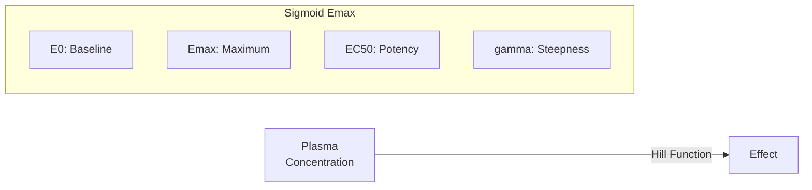

# Sigmoid Emax (Hill) Model

Extended Emax model with Hill coefficient (gamma) controlling the steepness of the concentration-response curve.

---

## Model Overview



### Clinical Applications

- Neuromuscular blocking agents
- Ion channel blockers
- Drugs with cooperative binding
- Threshold effects
- All-or-none responses
- Antibiotics (Hill-Langmuir model)

### When to Use

| Use When | Don't Use When |
|----------|----------------|
| Steep dose-response | gamma = 1 (use Direct Emax) |
| Threshold effects | Time delays needed |
| Cooperative binding | Complex hysteresis |
| Switch-like responses | Tolerance development |

---

## Mathematical Formulation

### Parameters

| Parameter | Symbol | Units | Description | Constraints |
|-----------|--------|-------|-------------|-------------|
| Baseline effect | E0 | varies | Effect with no drug | any real |
| Maximum effect | Emax | varies | Maximum drug-induced change | typically > 0 |
| Half-maximal concentration | EC50 | mg/L | Concentration at 50% Emax | EC50 > 0 |
| Hill coefficient | gamma (n) | - | Steepness/cooperativity | gamma > 0 |

### Hill Equation

$$E(C) = E_0 + \frac{E_{max} \cdot C^\gamma}{EC_{50}^\gamma + C^\gamma}$$

Equivalent formulation (more stable numerically):

$$E(C) = E_0 + \frac{E_{max}}{1 + (EC_{50}/C)^\gamma}$$

### Effect of Gamma

| Gamma Value | Curve Shape | Biological Interpretation |
|-------------|-------------|---------------------------|
| gamma < 1 | Shallow, gradual | Negative cooperativity |
| gamma = 1 | Standard Emax (hyperbolic) | Simple binding |
| gamma > 1 | Steep, sigmoidal | Positive cooperativity |
| gamma >> 3 | Near-threshold | All-or-none response |

---

## Model Behavior

### Concentration-Effect Curves by Gamma

```
Effect
   │
Emax├──────────────────────────────
    │         ╭───gamma=3──────────
    │       ╭─╯
    │      ╱  ╭──gamma=1 (Direct)──
    │     ╱  ╱
    │    ╱  ╱   ╭──gamma=0.5───────
    │   ╱  ╱   ╱
E0+½├──╳──╳───╳────────────────────
    │  │
 E0 ├──┴──────────────────────────→ C
     EC50
```

### Steepness at EC50

The slope at EC50 (inflection point):

$$\frac{dE}{dC}\bigg|_{C=EC_{50}} = \frac{\gamma \cdot E_{max}}{4 \cdot EC_{50}}$$

Higher gamma = steeper transition around EC50.

---

## Julia API

### Type Definitions

```julia
# Model kind
struct SigmoidEmax <: PDModelKind end

# Parameters
struct SigmoidEmaxParams
    E0::Float64      # Baseline effect
    Emax::Float64    # Maximum effect
    EC50::Float64    # Half-maximal concentration (mg/L)
    gamma::Float64   # Hill coefficient
end
```

### Basic Usage

```julia
using NeoPKPDCore

# Define Sigmoid Emax parameters
# gamma = 3 gives steep response
pd_params = SigmoidEmaxParams(0.0, 100.0, 2.0, 3.0)

# Create specification
pd_spec = PDSpec(SigmoidEmax(), "response", pd_params)

# Evaluate across concentration range
concentrations = [0.0, 0.5, 1.0, 1.5, 2.0, 2.5, 3.0, 4.0, 6.0]
effects = evaluate(pd_spec, concentrations)

for (c, e) in zip(concentrations, effects)
    println("C = $c: Effect = $(round(e, digits=1))%")
end
```

**Expected Output (gamma=3):**
```
C = 0.0: Effect = 0.0%
C = 0.5: Effect = 1.5%
C = 1.0: Effect = 11.1%
C = 1.5: Effect = 29.7%
C = 2.0: Effect = 50.0%
C = 2.5: Effect = 66.1%
C = 3.0: Effect = 77.1%
C = 4.0: Effect = 88.9%
C = 6.0: Effect = 96.4%
```

### Comparing Different Gamma Values

```julia
using NeoPKPDCore

gamma_values = [0.5, 1.0, 2.0, 3.0, 5.0]
EC50 = 2.0
Emax = 100.0

for gamma in gamma_values
    params = SigmoidEmaxParams(0.0, Emax, EC50, gamma)
    spec = PDSpec(SigmoidEmax(), "test", params)

    # Effect at different concentrations
    e_low = evaluate(spec, [EC50/2])[1]   # Below EC50
    e_mid = evaluate(spec, [EC50])[1]      # At EC50
    e_high = evaluate(spec, [EC50*2])[1]   # Above EC50

    println("gamma=$gamma: E(EC50/2)=$(round(e_low, digits=1)), ",
            "E(EC50)=$(round(e_mid, digits=1)), ",
            "E(2×EC50)=$(round(e_high, digits=1))")
end
```

**Expected Output:**
```
gamma=0.5: E(EC50/2)=41.4, E(EC50)=50.0, E(2×EC50)=58.6
gamma=1.0: E(EC50/2)=33.3, E(EC50)=50.0, E(2×EC50)=66.7
gamma=2.0: E(EC50/2)=20.0, E(EC50)=50.0, E(2×EC50)=80.0
gamma=3.0: E(EC50/2)=11.1, E(EC50)=50.0, E(2×EC50)=88.9
gamma=5.0: E(EC50/2)=3.0, E(EC50)=50.0, E(2×EC50)=97.0
```

---

## Derived Parameters

### Concentration at Any Fraction of Emax

For fraction f (0 < f < 1):

$$C_f = EC_{50} \cdot \left(\frac{f}{1-f}\right)^{1/\gamma}$$

```julia
# Helper function
function concentration_at_fraction(EC50::Float64, gamma::Float64, fraction::Float64)
    return EC50 * (fraction / (1 - fraction))^(1/gamma)
end

# Example: Find EC10 and EC90 for different gamma
EC50 = 2.0
for gamma in [1.0, 2.0, 3.0]
    EC10 = concentration_at_fraction(EC50, gamma, 0.1)
    EC90 = concentration_at_fraction(EC50, gamma, 0.9)
    ratio = EC90 / EC10

    println("gamma=$gamma: EC10=$(round(EC10, digits=2)), ",
            "EC90=$(round(EC90, digits=2)), ",
            "EC90/EC10=$(round(ratio, digits=1))")
end
```

**Expected Output:**
```
gamma=1: EC10=0.22, EC90=18.0, EC90/EC10=81.0
gamma=2: EC10=0.67, EC90=6.0, EC90/EC10=9.0
gamma=3: EC10=0.93, EC90=4.33, EC90/EC10=4.7
```

**Key insight**: Higher gamma compresses the concentration range between EC10 and EC90.

---

## Clinical Example: Neuromuscular Blockade

```julia
using NeoPKPDCore

# Rocuronium neuromuscular blockade
# Typical gamma = 3-4 (steep response)
# EC50 ≈ 1 mcg/mL for 50% twitch depression

pd_params = SigmoidEmaxParams(
    100.0,    # E0: 100% baseline twitch height
    -100.0,   # Emax: complete block possible
    1.0,      # EC50: 1 mcg/mL
    3.5       # gamma: steep response
)

spec = PDSpec(SigmoidEmax(), "twitch", pd_params)

# Clinical concentrations
concentrations = [0.0, 0.5, 0.75, 1.0, 1.25, 1.5, 2.0]
twitch = evaluate(spec, concentrations)

println("Neuromuscular Blockade:")
for (c, t) in zip(concentrations, twitch)
    block = 100 - t
    println("  C=$(c) mcg/mL: $(round(t, digits=1))% twitch ",
            "($(round(block, digits=1))% block)")
end
```

---

## PKPD Simulation with Steep Response

```julia
using NeoPKPDCore

# PK: Two-compartment IV
pk_params = TwoCompIVBolusParams(3.0, 10.0, 5.0, 30.0)
doses = [DoseEvent(0.0, 200.0)]  # 200 mg IV bolus

pk_spec = ModelSpec(TwoCompIVBolus(), "pk", pk_params, doses)

# PD: Sigmoid Emax with steep gamma
pd_params = SigmoidEmaxParams(0.0, 100.0, 5.0, 4.0)
pd_spec = PDSpec(SigmoidEmax(), "effect", pd_params)

# Simulate
grid = SimGrid(0.0, 24.0, collect(0.0:0.1:24.0))
solver = SolverSpec(:Tsit5, 1e-10, 1e-12, 10_000_000)

pk_result = simulate(pk_spec, grid, solver)
conc = pk_result.observations[:conc]
effects = evaluate(pd_spec, conc)

# Find duration of effect > 90% of Emax
threshold = 90.0
above_threshold = effects .> threshold
first_above = findfirst(above_threshold)
last_above = findlast(above_threshold)

if first_above !== nothing && last_above !== nothing
    duration = grid.times[last_above] - grid.times[first_above]
    println("Duration of effect > 90%: $(round(duration, digits=1)) hours")
end
```

---

## Therapeutic Index and Gamma

Higher gamma provides a narrower therapeutic window:

```julia
# Drug with narrow therapeutic index (high gamma)
# Effective concentration range is compressed

EC50_efficacy = 2.0
EC50_toxicity = 8.0  # 4× separation
gamma_efficacy = 3.0
gamma_toxicity = 3.0

params_eff = SigmoidEmaxParams(0.0, 100.0, EC50_efficacy, gamma_efficacy)
params_tox = SigmoidEmaxParams(0.0, 100.0, EC50_toxicity, gamma_toxicity)

spec_eff = PDSpec(SigmoidEmax(), "efficacy", params_eff)
spec_tox = PDSpec(SigmoidEmax(), "toxicity", params_tox)

# Find therapeutic window
# Target: >80% efficacy with <20% toxicity
concentrations = collect(0.0:0.1:12.0)
efficacy = evaluate(spec_eff, concentrations)
toxicity = evaluate(spec_tox, concentrations)

for (c, eff, tox) in zip(concentrations, efficacy, toxicity)
    if eff > 80.0 && tox < 20.0
        println("C=$c: Efficacy=$(round(eff, digits=1))%, Toxicity=$(round(tox, digits=1))%")
    end
end
```

---

## Numerical Stability

For large gamma values, use the stable form:

```julia
# Standard form (may overflow for large gamma and C >> EC50):
# E = E0 + Emax * C^gamma / (EC50^gamma + C^gamma)

# Stable form (used internally):
# E = E0 + Emax / (1 + (EC50/C)^gamma)

function sigmoid_emax_stable(C, E0, Emax, EC50, gamma)
    if C <= 0.0
        return E0
    end
    ratio = (EC50 / C)^gamma
    return E0 + Emax / (1.0 + ratio)
end
```

---

## Equations Summary

| Quantity | Formula |
|----------|---------|
| Effect | $E_0 + \frac{E_{max} \cdot C^\gamma}{EC_{50}^\gamma + C^\gamma}$ |
| Stable form | $E_0 + \frac{E_{max}}{1 + (EC_{50}/C)^\gamma}$ |
| C at fraction f | $EC_{50} \cdot (f/(1-f))^{1/\gamma}$ |
| Slope at EC50 | $\gamma \cdot E_{max} / (4 \cdot EC_{50})$ |
| EC90/EC10 ratio | $81^{1/\gamma}$ |

---

## See Also

- [Direct Emax Model](direct-emax.md) - Gamma = 1 case
- [Effect Compartment Model](effect-compartment.md) - With temporal delay
- [Indirect Response Models](indirect-response.md) - Mechanism-based
- [Population Modeling](../../population/index.md) - Population PKPD
