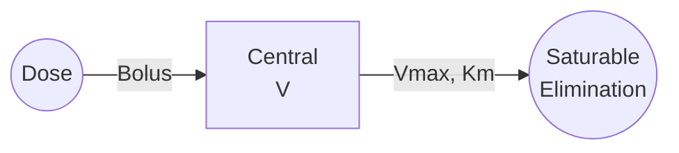

# Michaelis-Menten Elimination

One-compartment model with saturable (capacity-limited) elimination kinetics, where clearance depends on concentration.

---

## Model Overview



### Clinical Applications

- High-dose therapeutics
- Phenytoin, ethanol, aspirin (high dose)
- Biologics with target-mediated disposition
- Enzyme saturation scenarios
- Dose-dependent kinetics

### When to Use

| Use When | Don't Use When |
|----------|----------------|
| Nonlinear kinetics | Linear (first-order) elimination |
| Dose-dependent t½ | Constant half-life |
| Disproportionate AUC ↑ | Dose-proportional exposure |
| Saturable metabolism | Low concentration range |

---

## Mathematical Formulation

### Parameters

| Parameter | Symbol | Units | Description | Constraints |
|-----------|--------|-------|-------------|-------------|
| Maximum rate | Vmax | mg/h | Maximum elimination rate | Vmax > 0 |
| Michaelis constant | Km | mg/L | Concentration at 50% Vmax | Km > 0 |
| Volume | V | L | Volume of distribution | V > 0 |

### Differential Equation

In terms of amount:

$$\frac{dA}{dt} = -\frac{V_{max} \cdot A}{K_m \cdot V + A}$$

In terms of concentration:

$$\frac{dC}{dt} = -\frac{V_{max} \cdot C}{K_m + C}$$

### Observation

$$C = \frac{A}{V}$$

---

## Kinetic Behavior

### Concentration-Dependent Kinetics

| Condition | Behavior | Effective CL |
|-----------|----------|--------------|
| C << Km | First-order (linear) | CL ≈ Vmax/Km |
| C ≈ Km | Mixed-order | Variable |
| C >> Km | Zero-order (saturated) | Rate ≈ Vmax |

### Apparent Clearance

$$CL_{app} = \frac{V_{max}}{K_m + C}$$

At low concentrations: $CL_{max} = V_{max}/K_m$

### Apparent Half-Life

Half-life is concentration-dependent:

$$t_{1/2} \approx \frac{0.693 \cdot V \cdot (K_m + C)}{V_{max}}$$

At low C: $t_{1/2,min} = 0.693 \cdot V \cdot K_m / V_{max}$

---

## Julia API

### Type Definitions

```julia
# Model kind
struct MichaelisMentenElimination <: ModelKind end

# Parameters
struct MichaelisMentenEliminationParams <: AbstractParams
    Vmax::Float64  # Maximum elimination rate (mg/h)
    Km::Float64    # Michaelis constant (mg/L)
    V::Float64     # Volume of distribution (L)
end
```

### Basic Simulation

```julia
using NeoPKPDCore

# Define parameters
# Vmax = 500 mg/h, Km = 10 mg/L, V = 50 L
params = MichaelisMentenEliminationParams(500.0, 10.0, 50.0)

# Single 1000 mg dose
doses = [DoseEvent(0.0, 1000.0)]

# Create specification
spec = ModelSpec(
    MichaelisMentenElimination(),
    "mm_example",
    params,
    doses
)

# Time grid
grid = SimGrid(0.0, 48.0, collect(0.0:0.25:48.0))

# Solver
solver = SolverSpec(:Tsit5, 1e-10, 1e-12, 10_000_000)

# Run simulation
result = simulate(spec, grid, solver)

# Check concentration-dependent kinetics
conc = result.observations[:conc]
t = result.t

println("C0: ", round(conc[1], digits=2), " mg/L (C >> Km: saturated)")
println("C at 6h: ", round(conc[25], digits=2), " mg/L")
println("C at 24h: ", round(conc[97], digits=3), " mg/L (C < Km: linear)")
```

### Dose-Dependent Half-Life

```julia
# Compare half-lives at different doses
doses_list = [100.0, 500.0, 1000.0, 2000.0]

for dose in doses_list
    doses = [DoseEvent(0.0, dose)]
    spec = ModelSpec(MichaelisMentenElimination(), "dose_$dose", params, doses)
    grid = SimGrid(0.0, 96.0, collect(0.0:0.5:96.0))

    result = simulate(spec, grid, solver)
    conc = result.observations[:conc]

    # Find t½ (time to reach half of initial)
    c0 = conc[1]
    target = c0 / 2
    idx = findfirst(x -> x <= target, conc)

    if idx !== nothing
        t_half = result.t[idx]
        println("Dose $(dose) mg: t½ = $(round(t_half, digits=2)) h")
    else
        println("Dose $(dose) mg: t½ > 96 h")
    end
end
```

**Expected Results:**
- Higher doses → Longer t½ (saturation)
- Low doses → Shorter t½ (linear kinetics)

---

## Dose Proportionality

```julia
# AUC increases more than proportionally with dose
doses_list = [100.0, 200.0, 500.0, 1000.0]
auc_values = Float64[]

for dose in doses_list
    doses = [DoseEvent(0.0, dose)]
    spec = ModelSpec(MichaelisMentenElimination(), "dose_$dose", params, doses)
    grid = SimGrid(0.0, 120.0, collect(0.0:0.1:120.0))

    result = simulate(spec, grid, solver)
    conc = result.observations[:conc]

    # Approximate AUC (trapezoidal)
    auc = sum(conc) * 0.1
    push!(auc_values, auc)

    println("Dose $(dose) mg: AUC ≈ $(round(auc, digits=1)) mg·h/L")
end

# Check proportionality
println("\nDose ratio (10x): ", doses_list[4] / doses_list[1])
println("AUC ratio: ", round(auc_values[4] / auc_values[1], digits=2))
# AUC ratio > 10 indicates saturation
```

---

## Clinical Example: Phenytoin

```julia
# Phenytoin typical parameters
# Vmax ≈ 7 mg/kg/day, Km ≈ 4-6 mg/L, V ≈ 0.65 L/kg
# For 70 kg patient:
params_phenytoin = MichaelisMentenEliminationParams(
    7.0 * 70 / 24,  # Vmax in mg/h (≈ 20 mg/h)
    5.0,            # Km (mg/L)
    0.65 * 70       # V (≈ 45.5 L)
)

# Loading dose followed by maintenance
loading = 15 * 70  # 15 mg/kg loading
maintenance = 300.0 / 24 * 24  # 300 mg/day as continuous equivalent

# Simulate loading
doses_loading = [DoseEvent(0.0, loading)]
spec_loading = ModelSpec(MichaelisMentenElimination(), "phenytoin_load",
                         params_phenytoin, doses_loading)
grid = SimGrid(0.0, 24.0, collect(0.0:0.5:24.0))

result = simulate(spec_loading, grid, solver)

# Therapeutic range: 10-20 mg/L
conc = result.observations[:conc]
println("Post-loading C: ", round(conc[1], digits=1), " mg/L")
println("24h C: ", round(conc[end], digits=1), " mg/L")
```

---

## Steady-State Considerations

At steady state with constant infusion rate R:

$$C_{ss} = \frac{R \cdot K_m}{V_{max} - R}$$

This only applies when R < Vmax. If R ≥ Vmax, no steady state is achievable.

```julia
# Critical infusion rate
Vmax = params.Vmax
println("Maximum sustainable infusion rate: ", Vmax, " mg/h")

# At 80% of Vmax
R = 0.8 * Vmax
Css = (R * params.Km) / (Vmax - R)
println("At R = $(R) mg/h: Css = $(round(Css, digits=1)) mg/L")
```

---

## Population Simulation

```julia
# Typical parameters
typical_params = MichaelisMentenEliminationParams(500.0, 10.0, 50.0)

# IIV: High variability on Vmax and Km
omega = OmegaMatrix([
    0.16 0.0  0.0;     # ω²_Vmax (40% CV)
    0.0  0.25 0.0;     # ω²_Km (50% CV)
    0.0  0.0  0.04     # ω²_V (20% CV)
])

doses = [DoseEvent(0.0, 1000.0)]
base_spec = ModelSpec(MichaelisMentenElimination(), "pop", typical_params, doses)

pop_spec = PopulationSpec(base_spec, 50, omega, 12345)

grid = SimGrid(0.0, 48.0, collect(0.0:0.5:48.0))
result = simulate_population(pop_spec, grid, solver)

# High variability in exposure due to nonlinear kinetics
# Small changes in Vmax/Km cause large changes in AUC at high doses
```

---

## Comparison with Linear Elimination

```julia
# Michaelis-Menten at low dose (approximately linear)
params_mm = MichaelisMentenEliminationParams(500.0, 10.0, 50.0)
# Equivalent linear: CL = Vmax/Km = 50 L/h

params_linear = OneCompIVBolusParams(50.0, 50.0)  # CL = 50 L/h, V = 50 L

# Low dose: 100 mg (C0 = 2 mg/L << Km = 10)
doses_low = [DoseEvent(0.0, 100.0)]

# High dose: 2000 mg (C0 = 40 mg/L >> Km = 10)
doses_high = [DoseEvent(0.0, 2000.0)]

grid = SimGrid(0.0, 24.0, collect(0.0:0.1:24.0))

# At low dose, MM ≈ linear
spec_mm_low = ModelSpec(MichaelisMentenElimination(), "mm_low", params_mm, doses_low)
spec_lin_low = ModelSpec(OneCompIVBolus(), "lin_low", params_linear, doses_low)

result_mm_low = simulate(spec_mm_low, grid, solver)
result_lin_low = simulate(spec_lin_low, grid, solver)

# Nearly identical at low dose
println("Low dose (100 mg):")
println("  MM at 4h: ", round(result_mm_low.observations[:conc][41], digits=3))
println("  Linear at 4h: ", round(result_lin_low.observations[:conc][41], digits=3))
```

---

## Equations Summary

| Quantity | Formula |
|----------|---------|
| Elimination rate | $-V_{max} \cdot C / (K_m + C)$ |
| CL_apparent | $V_{max} / (K_m + C)$ |
| CL_max (C→0) | $V_{max} / K_m$ |
| t½ (apparent) | $0.693 \cdot V \cdot (K_m + C) / V_{max}$ |
| Css (infusion R) | $R \cdot K_m / (V_{max} - R)$ |

---

## See Also

- [One-Compartment IV Bolus](onecomp-iv-bolus.md) - Linear model
- [Population Modeling](../../population/index.md) - Adding variability
- [Parameter Estimation](../../estimation/index.md) - Fitting nonlinear models
