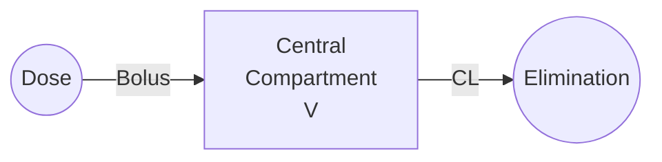

# One-Compartment IV Bolus

The simplest pharmacokinetic model representing instantaneous drug administration into a single well-mixed compartment with first-order elimination.

---

## Model Overview



### Clinical Applications

- Simple IV drugs with rapid distribution
- Initial PK characterization studies
- Drugs without significant tissue distribution
- Loading dose calculations
- TDM (Therapeutic Drug Monitoring)

### When to Use

| Use When | Don't Use When |
|----------|----------------|
| Mono-exponential decline | Bi/tri-exponential decline |
| Rapid equilibration | Significant distribution phase |
| Small molecules | Large molecules with tissue binding |
| Initial screening | Final model development |

---

## Mathematical Formulation

### Parameters

| Parameter | Symbol | Units | Description | Constraints |
|-----------|--------|-------|-------------|-------------|
| Clearance | CL | L/h | Volume of plasma cleared per time | CL > 0 |
| Volume | V | L | Apparent volume of distribution | V > 0 |

### Micro-Rate Constant

$$k_{el} = \frac{CL}{V}$$

### State Variable

| State | Symbol | Units | Description |
|-------|--------|-------|-------------|
| Amount in central | A | mg | Drug amount in compartment |

### Differential Equation

$$\frac{dA}{dt} = -k_{el} \cdot A = -\frac{CL}{V} \cdot A$$

### Analytical Solution

For a single bolus dose $D$ at $t = 0$:

$$A(t) = D \cdot e^{-k_{el} \cdot t}$$

$$C(t) = \frac{D}{V} \cdot e^{-k_{el} \cdot t} = C_0 \cdot e^{-k_{el} \cdot t}$$

Where $C_0 = D/V$ is the initial concentration.

### Observation

$$C = \frac{A}{V}$$

---

## Derived Parameters

### Half-Life

$$t_{1/2} = \frac{\ln(2)}{k_{el}} = \frac{0.693 \cdot V}{CL}$$

### AUC (Single Dose)

$$AUC_{0-\infty} = \frac{D}{CL}$$

### Steady-State (Multiple Dosing)

For dose $D$ given every $\tau$ hours:

$$C_{ss,max} = \frac{D/V}{1 - e^{-k_{el} \cdot \tau}}$$

$$C_{ss,min} = C_{ss,max} \cdot e^{-k_{el} \cdot \tau}$$

$$C_{ss,avg} = \frac{D}{CL \cdot \tau}$$

### Accumulation Factor

$$R = \frac{1}{1 - e^{-k_{el} \cdot \tau}}$$

---

## Julia API

### Type Definitions

```julia
# Model kind
struct OneCompIVBolus <: ModelKind end

# Parameters
struct OneCompIVBolusParams <: AbstractParams
    CL::Float64    # Clearance (L/h)
    V::Float64     # Volume (L)
end
```

### Basic Simulation

```julia
using OpenPKPDCore

# Define parameters
params = OneCompIVBolusParams(5.0, 50.0)  # CL=5 L/h, V=50 L

# Single 100 mg dose at t=0
doses = [DoseEvent(0.0, 100.0)]

# Create model specification
spec = ModelSpec(
    OneCompIVBolus(),
    "onecomp_iv_example",
    params,
    doses
)

# Define time grid (0 to 24 hours, hourly)
grid = SimGrid(0.0, 24.0, collect(0.0:1.0:24.0))

# Configure solver (high precision for validation)
solver = SolverSpec(:Tsit5, 1e-10, 1e-12, 10_000_000)

# Run simulation
result = simulate(spec, grid, solver)

# Access results
println("Time: ", result.t)
println("Concentration: ", result.observations[:conc])
println("Amount: ", result.states[:A_central])
```

### Expected Output

```
Time: [0.0, 1.0, 2.0, ..., 24.0]
Concentration: [2.0, 1.8097, 1.6375, 1.4816, 1.3406, ...]
Amount: [100.0, 90.48, 81.87, 74.08, 67.03, ...]
```

### Multiple Dosing

```julia
# 100 mg every 12 hours for 3 days
doses = [
    DoseEvent(0.0, 100.0),
    DoseEvent(12.0, 100.0),
    DoseEvent(24.0, 100.0),
    DoseEvent(36.0, 100.0),
    DoseEvent(48.0, 100.0),
    DoseEvent(60.0, 100.0),
]

spec = ModelSpec(OneCompIVBolus(), "multiple_dose", params, doses)
grid = SimGrid(0.0, 72.0, collect(0.0:0.5:72.0))

result = simulate(spec, grid, solver)

# Find steady-state trough (just before 6th dose)
trough_idx = findfirst(x -> x ≈ 59.5, result.t)
println("Steady-state trough: ", result.observations[:conc][trough_idx])
```

### IV Infusion

```julia
# 100 mg infused over 1 hour (duration parameter)
doses = [DoseEvent(0.0, 100.0, 1.0)]

spec = ModelSpec(OneCompIVBolus(), "infusion", params, doses)
grid = SimGrid(0.0, 24.0, collect(0.0:0.25:24.0))

result = simulate(spec, grid, solver)

# Cmax at end of infusion
idx_1h = findfirst(x -> x ≈ 1.0, result.t)
println("Cmax at end of infusion: ", result.observations[:conc][idx_1h])
```

---

## Parameter Estimation

### Fitting from Data

```julia
# Observed data
data = EstimationData(
    ids = [1, 1, 1, 1, 1],
    times = [0.5, 1.0, 2.0, 4.0, 8.0],
    dv = [1.8, 1.6, 1.3, 0.9, 0.4],
    doses = [DoseEvent(0.0, 100.0)],
    dose_ids = [1, 1, 1, 1, 1]
)

# Initial estimates
init = InitialEstimates(
    theta = [5.0, 50.0],     # CL, V
    omega = [0.09, 0.04],    # IIV on CL, V
    sigma = [0.01]           # Proportional error
)

# Fit with FOCE
result = estimate(data, OneCompIVBolus(), init, FOCEConfig())

println("Estimated CL: ", result.theta[1])
println("Estimated V: ", result.theta[2])
```

---

## Population Simulation

```julia
# Typical parameters
typical_params = OneCompIVBolusParams(5.0, 50.0)

# IIV: 30% CV on CL, 20% CV on V
omega = OmegaMatrix([
    0.09 0.0;
    0.0  0.04
])

doses = [DoseEvent(0.0, 100.0)]
base_spec = ModelSpec(OneCompIVBolus(), "pop", typical_params, doses)

pop_spec = PopulationSpec(base_spec, 100, omega, 12345)

grid = SimGrid(0.0, 24.0, collect(0.0:1.0:24.0))
result = simulate_population(pop_spec, grid, solver)

# Population summary
summary = result.summaries[:conc]
println("Median Cmax: ", maximum(summary.median))
println("90% PI: ", maximum(summary.quantiles[0.05]), " - ",
        maximum(summary.quantiles[0.95]))
```

---

## Validation

### Analytical Verification

```julia
# Compare simulation to analytical solution
D = 100.0   # Dose
CL = 5.0    # Clearance
V = 50.0    # Volume
k = CL / V  # Elimination rate

t = collect(0.0:0.1:24.0)

# Analytical solution
C_analytical = (D / V) .* exp.(-k .* t)

# Simulation
params = OneCompIVBolusParams(CL, V)
doses = [DoseEvent(0.0, D)]
spec = ModelSpec(OneCompIVBolus(), "validation", params, doses)
grid = SimGrid(0.0, 24.0, t)
result = simulate(spec, grid, solver)

C_simulated = result.observations[:conc]

# Check agreement
max_error = maximum(abs.(C_analytical .- C_simulated))
println("Maximum error: ", max_error)  # Should be < 1e-10
```

---

## Clinical Examples

### Example 1: Aminoglycoside Dosing

```julia
# Gentamicin: CL ≈ 5 L/h, V ≈ 15 L
params = OneCompIVBolusParams(5.0, 15.0)

# Calculate dosing for target Cmax of 8 mg/L
target_cmax = 8.0
dose = target_cmax * params.V  # 120 mg

doses = [DoseEvent(0.0, dose)]
spec = ModelSpec(OneCompIVBolus(), "gentamicin", params, doses)
grid = SimGrid(0.0, 24.0, collect(0.0:0.5:24.0))

result = simulate(spec, grid, solver)
println("Achieved Cmax: ", maximum(result.observations[:conc]))
```

### Example 2: Loading Dose Calculation

```julia
# Target steady-state average: 10 mg/L
# CL = 5 L/h, dosing interval τ = 8 h
target_css_avg = 10.0
CL = 5.0
tau = 8.0

maintenance_dose = target_css_avg * CL * tau  # 400 mg

# Loading dose for immediate effect
V = 50.0
loading_dose = target_css_avg * V  # 500 mg

println("Loading dose: ", loading_dose, " mg")
println("Maintenance dose: ", maintenance_dose, " mg q", tau, "h")
```

---

## Equations Summary

| Quantity | Formula |
|----------|---------|
| Rate constant | $k_{el} = CL/V$ |
| Concentration | $C(t) = (D/V) \cdot e^{-k_{el} \cdot t}$ |
| Half-life | $t_{1/2} = 0.693/k_{el}$ |
| AUC | $AUC = D/CL$ |
| Steady-state average | $C_{ss,avg} = D/(CL \cdot \tau)$ |
| Accumulation | $R = 1/(1 - e^{-k_{el} \cdot \tau})$ |

---

## See Also

- [One-Compartment Oral](onecomp-oral.md) - With first-order absorption
- [Two-Compartment IV](twocomp-iv.md) - For distribution kinetics
- [Michaelis-Menten](michaelis-menten.md) - For saturable elimination
- [Population Modeling](../../population/index.md) - Adding variability
