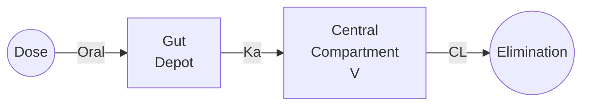

# One-Compartment Oral First-Order

One-compartment model with first-order absorption from a depot (gut) compartment, representing the most common oral PK profile.

---

## Model Overview



### Clinical Applications

- Immediate-release oral formulations
- Most oral tablets and capsules
- Simple oral PK characterization
- Bioavailability studies
- Food effect studies

### When to Use

| Use When | Don't Use When |
|----------|----------------|
| Simple first-order absorption | Delayed or complex absorption |
| Mono-exponential elimination | Significant distribution phase |
| Single Tmax | Multiple peaks |
| F is constant | Nonlinear bioavailability |

---

## Mathematical Formulation

### Parameters

| Parameter | Symbol | Units | Description | Constraints |
|-----------|--------|-------|-------------|-------------|
| Absorption rate | Ka | 1/h | First-order absorption rate constant | Ka > 0 |
| Clearance | CL | L/h | Apparent clearance (CL/F) | CL > 0 |
| Volume | V | L | Apparent volume (V/F) | V > 0 |

### State Variables

| State | Symbol | Units | Description |
|-------|--------|-------|-------------|
| Amount in gut | A_gut | mg | Drug amount in absorption depot |
| Amount in central | A_central | mg | Drug amount in central compartment |

### Differential Equations

$$\frac{dA_{gut}}{dt} = -K_a \cdot A_{gut}$$

$$\frac{dA_{central}}{dt} = K_a \cdot A_{gut} - \frac{CL}{V} \cdot A_{central}$$

### Analytical Solution

For a single oral dose $D$ at $t = 0$:

$$C(t) = \frac{D \cdot K_a}{V \cdot (K_a - k_{el})} \cdot \left( e^{-k_{el} \cdot t} - e^{-K_a \cdot t} \right)$$

Where $k_{el} = CL/V$.

### Observation

$$C = \frac{A_{central}}{V}$$

---

## Derived Parameters

### Time to Maximum Concentration (Tmax)

$$t_{max} = \frac{\ln(K_a) - \ln(k_{el})}{K_a - k_{el}} = \frac{\ln(K_a/k_{el})}{K_a - k_{el}}$$

### Maximum Concentration (Cmax)

$$C_{max} = \frac{D}{V} \cdot e^{-k_{el} \cdot t_{max}}$$

Or equivalently:

$$C_{max} = \frac{D}{V} \cdot \left( \frac{k_{el}}{K_a} \right)^{\frac{k_{el}}{K_a - k_{el}}}$$

### Half-Life

$$t_{1/2} = \frac{0.693 \cdot V}{CL}$$

### AUC

$$AUC_{0-\infty} = \frac{D}{CL}$$

Note: AUC is independent of Ka for complete absorption.

### Mean Absorption Time (MAT)

$$MAT = \frac{1}{K_a}$$

---

## Julia API

### Type Definitions

```julia
# Model kind
struct OneCompOralFirstOrder <: ModelKind end

# Parameters
struct OneCompOralFirstOrderParams <: AbstractParams
    Ka::Float64    # Absorption rate constant (1/h)
    CL::Float64    # Clearance (L/h)
    V::Float64     # Volume (L)
end
```

### Basic Simulation

```julia
using NeoPKPDCore

# Define parameters
# Ka = 1.5/h (absorption t½ ≈ 0.46 h)
# CL = 5 L/h, V = 50 L (elimination t½ = 6.93 h)
params = OneCompOralFirstOrderParams(1.5, 5.0, 50.0)

# Single 200 mg oral dose
doses = [DoseEvent(0.0, 200.0)]

# Create specification
spec = ModelSpec(
    OneCompOralFirstOrder(),
    "oral_example",
    params,
    doses
)

# Time grid with fine resolution around Tmax
grid = SimGrid(0.0, 24.0, collect(0.0:0.25:24.0))

# Solver
solver = SolverSpec(:Tsit5, 1e-10, 1e-12, 10_000_000)

# Run simulation
result = simulate(spec, grid, solver)

# Find Cmax and Tmax
conc = result.observations[:conc]
t = result.t
cmax, idx = findmax(conc)
tmax = t[idx]

println("Cmax: ", round(cmax, digits=2), " mg/L")
println("Tmax: ", round(tmax, digits=2), " h")
```

### Expected Output

```
Cmax: 2.67 mg/L
Tmax: 1.50 h
```

### Multiple Dosing

```julia
# 200 mg twice daily for 7 days
doses = DoseEvent[]
for day in 0:6
    push!(doses, DoseEvent(day * 24.0, 200.0))        # Morning
    push!(doses, DoseEvent(day * 24.0 + 12.0, 200.0)) # Evening
end

spec = ModelSpec(OneCompOralFirstOrder(), "bid_dosing", params, doses)
grid = SimGrid(0.0, 168.0, collect(0.0:1.0:168.0))

result = simulate(spec, grid, solver)

# Steady-state achieved after ~5 half-lives
# t½ = 6.93 h, so ~35 hours
```

### Flip-Flop Kinetics

When Ka < kel, the terminal slope reflects absorption, not elimination:

```julia
# Slow absorption (Ka < kel)
# Ka = 0.05/h (absorption t½ = 13.9 h)
# kel = 0.1/h (elimination t½ = 6.93 h)
params_flipflop = OneCompOralFirstOrderParams(0.05, 5.0, 50.0)

# Normal kinetics (Ka > kel)
params_normal = OneCompOralFirstOrderParams(1.5, 5.0, 50.0)

# Compare terminal slopes
# In flip-flop: terminal slope = Ka
# In normal: terminal slope = kel
```

---

## Bioavailability Considerations

### Apparent Parameters

The estimated CL and V are apparent values:

$$CL_{apparent} = \frac{CL}{F}$$

$$V_{apparent} = \frac{V}{F}$$

Where F is the absolute bioavailability (fraction absorbed).

### Bioavailability Calculation

If IV data is available:

$$F = \frac{AUC_{oral} / Dose_{oral}}{AUC_{IV} / Dose_{IV}}$$

### Relative Bioavailability

For comparing formulations:

$$F_{rel} = \frac{AUC_{test} / Dose_{test}}{AUC_{reference} / Dose_{reference}}$$

---

## Population Simulation

```julia
# Typical parameters
typical_params = OneCompOralFirstOrderParams(1.5, 5.0, 50.0)

# IIV: 40% CV on Ka, 30% CV on CL, 20% CV on V
omega = OmegaMatrix([
    0.16 0.0  0.0;   # ω²_Ka
    0.0  0.09 0.0;   # ω²_CL
    0.0  0.0  0.04   # ω²_V
])

doses = [DoseEvent(0.0, 200.0)]
base_spec = ModelSpec(OneCompOralFirstOrder(), "pop", typical_params, doses)

pop_spec = PopulationSpec(base_spec, 100, omega, 12345)

grid = SimGrid(0.0, 24.0, collect(0.0:0.5:24.0))
result = simulate_population(pop_spec, grid, solver)

# Variability in Tmax due to Ka IIV
for i in 1:5
    conc = result.individuals[i].observations[:conc]
    t = result.individuals[i].t
    _, idx = findmax(conc)
    println("Subject $i: Tmax = ", t[idx], " h")
end
```

---

## Special Cases

### Zero-Time Dose

When dose is at t=0, initial conditions:
- A_gut(0) = Dose
- A_central(0) = 0

### Lag Time

For delayed absorption, use transit compartments or specify lag:

```julia
# Simple lag time implementation
lag = 0.5  # 30 minute lag

# Shift dose time
doses = [DoseEvent(lag, 200.0)]
grid = SimGrid(0.0, 24.0, collect(0.0:0.25:24.0))

# Or use transit compartment model for more realistic delay
```

### Food Effect

Food can affect both Ka and F:

```julia
# Fasted state
params_fasted = OneCompOralFirstOrderParams(2.0, 5.0, 50.0)

# Fed state (slower absorption, possibly higher F)
params_fed = OneCompOralFirstOrderParams(0.8, 4.0, 50.0)  # CL/F lower if F higher
```

---

## Validation Example

```julia
# Compare to analytical solution
D = 200.0
Ka = 1.5
CL = 5.0
V = 50.0
kel = CL / V

t = collect(0.0:0.1:24.0)

# Analytical solution (Bateman function)
C_analytical = (D * Ka) / (V * (Ka - kel)) .* (exp.(-kel .* t) .- exp.(-Ka .* t))

# Simulation
params = OneCompOralFirstOrderParams(Ka, CL, V)
doses = [DoseEvent(0.0, D)]
spec = ModelSpec(OneCompOralFirstOrder(), "validation", params, doses)
grid = SimGrid(0.0, 24.0, t)
result = simulate(spec, grid, solver)

C_simulated = result.observations[:conc]

# Check agreement
max_error = maximum(abs.(C_analytical .- C_simulated))
println("Maximum error: ", max_error)  # Should be < 1e-9
```

---

## Equations Summary

| Quantity | Formula |
|----------|---------|
| Absorption rate | $k_a$ |
| Elimination rate | $k_{el} = CL/V$ |
| Tmax | $t_{max} = \ln(K_a/k_{el}) / (K_a - k_{el})$ |
| Concentration | $C(t) = \frac{D \cdot K_a}{V(K_a - k_{el})} (e^{-k_{el}t} - e^{-K_at})$ |
| Half-life | $t_{1/2} = 0.693/k_{el}$ |
| AUC | $AUC = D/CL$ |
| MAT | $MAT = 1/K_a$ |

---

## See Also

- [One-Compartment IV Bolus](onecomp-iv-bolus.md) - Without absorption
- [Two-Compartment Oral](twocomp-oral.md) - With distribution
- [Transit Absorption](transit-absorption.md) - For complex absorption
- [NCA Reference](../../nca/index.md) - Exposure calculations
