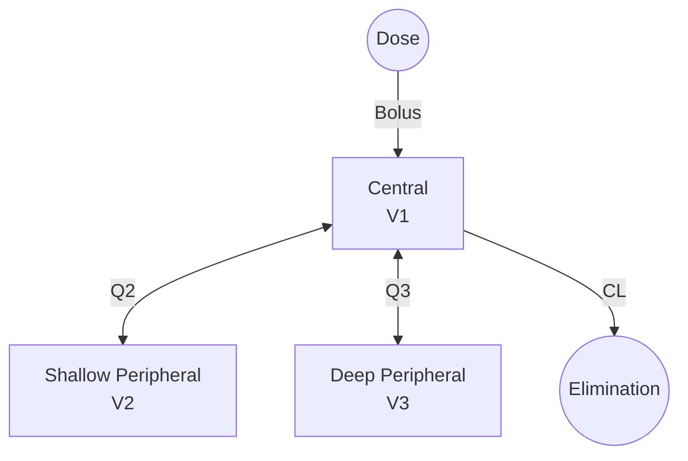

# Three-Compartment IV Bolus

Three-compartment mammillary model with central, shallow peripheral, and deep peripheral compartments, exhibiting tri-exponential concentration decline.

---

## Model Overview



### Clinical Applications

- Highly lipophilic drugs
- Drugs with deep tissue binding
- Long half-life compounds
- Anesthetics (propofol, fentanyl)
- Monoclonal antibodies
- Drugs with bone/fat distribution

### When to Use

| Use When | Don't Use When |
|----------|----------------|
| Tri-exponential decline | Bi-exponential adequate |
| Very long terminal t½ | Simple tissue distribution |
| Deep tissue binding | Two compartments sufficient |
| Three distinct phases | Overfitting concerns |

---

## Mathematical Formulation

### Parameters

| Parameter | Symbol | Units | Description | Constraints |
|-----------|--------|-------|-------------|-------------|
| Clearance | CL | L/h | Systemic clearance | CL > 0 |
| Central volume | V1 | L | Central compartment | V1 > 0 |
| Shallow Q | Q2 | L/h | Clearance to shallow peripheral | Q2 > 0 |
| Shallow volume | V2 | L | Shallow peripheral volume | V2 > 0 |
| Deep Q | Q3 | L/h | Clearance to deep peripheral | Q3 > 0 |
| Deep volume | V3 | L | Deep peripheral volume | V3 > 0 |

### Micro-Rate Constants

$$k_{10} = \frac{CL}{V_1}$$ (elimination)

$$k_{12} = \frac{Q_2}{V_1}$$, $$k_{21} = \frac{Q_2}{V_2}$$ (shallow transfer)

$$k_{13} = \frac{Q_3}{V_1}$$, $$k_{31} = \frac{Q_3}{V_3}$$ (deep transfer)

### State Variables

| State | Symbol | Description |
|-------|--------|-------------|
| A1 | Central | Amount in central compartment |
| A2 | Shallow | Amount in shallow peripheral |
| A3 | Deep | Amount in deep peripheral |

### Differential Equations

$$\frac{dA_1}{dt} = -(k_{10} + k_{12} + k_{13}) \cdot A_1 + k_{21} \cdot A_2 + k_{31} \cdot A_3$$

$$\frac{dA_2}{dt} = k_{12} \cdot A_1 - k_{21} \cdot A_2$$

$$\frac{dA_3}{dt} = k_{13} \cdot A_1 - k_{31} \cdot A_3$$

### Tri-Exponential Solution

$$C(t) = A \cdot e^{-\alpha t} + B \cdot e^{-\beta t} + C \cdot e^{-\gamma t}$$

Where:
- α = fast (initial distribution) rate
- β = intermediate rate
- γ = slow (terminal) rate
- α > β > γ

### Observation

$$C = \frac{A_1}{V_1}$$

---

## Derived Parameters

### Volume at Steady State

$$V_{ss} = V_1 + V_2 + V_3$$

### Half-Lives

$$t_{1/2,\alpha} = \frac{0.693}{\alpha}$$ (rapid distribution)

$$t_{1/2,\beta} = \frac{0.693}{\beta}$$ (slow distribution)

$$t_{1/2,\gamma} = \frac{0.693}{\gamma}$$ (terminal elimination)

### Mean Residence Time

$$MRT = \frac{V_{ss}}{CL}$$

---

## Julia API

### Type Definitions

```julia
# Model kind
struct ThreeCompIVBolus <: ModelKind end

# Parameters
struct ThreeCompIVBolusParams <: AbstractParams
    CL::Float64    # Clearance (L/h)
    V1::Float64    # Central volume (L)
    Q2::Float64    # Shallow peripheral clearance (L/h)
    V2::Float64    # Shallow peripheral volume (L)
    Q3::Float64    # Deep peripheral clearance (L/h)
    V3::Float64    # Deep peripheral volume (L)
end
```

### Basic Simulation

```julia
using NeoPKPD

# Define parameters
# CL = 5 L/h, V1 = 10 L
# Q2 = 20 L/h, V2 = 30 L (rapid equilibration)
# Q3 = 5 L/h, V3 = 100 L (slow equilibration)
params = ThreeCompIVBolusParams(5.0, 10.0, 20.0, 30.0, 5.0, 100.0)

# Single 1000 mg IV bolus
doses = [DoseEvent(0.0, 1000.0)]

# Create specification
spec = ModelSpec(
    ThreeCompIVBolus(),
    "threecomp_example",
    params,
    doses
)

# Long simulation to capture terminal phase (7 days)
grid = SimGrid(0.0, 168.0, collect(0.0:0.5:168.0))

# Solver
solver = SolverSpec(:Tsit5, 1e-10, 1e-12, 10_000_000)

# Run simulation
result = simulate(spec, grid, solver)

# Observe three phases
conc = result.observations[:conc]
t = result.t

println("C at t=0: ", round(conc[1], digits=2), " mg/L (initial)")
println("C at t=1h: ", round(conc[3], digits=2), " mg/L (α phase)")
println("C at t=12h: ", round(conc[25], digits=2), " mg/L (β phase)")
println("C at t=168h: ", round(conc[end], digits=4), " mg/L (γ phase)")
```

### Calculate Rate Constants

```julia
# Micro-rate constants
k10 = params.CL / params.V1
k12 = params.Q2 / params.V1
k21 = params.Q2 / params.V2
k13 = params.Q3 / params.V1
k31 = params.Q3 / params.V3

println("k10 (elimination): ", round(k10, digits=3), " 1/h")
println("k12 (to shallow): ", round(k12, digits=3), " 1/h")
println("k21 (from shallow): ", round(k21, digits=3), " 1/h")
println("k13 (to deep): ", round(k13, digits=3), " 1/h")
println("k31 (from deep): ", round(k31, digits=3), " 1/h")

# Vss and MRT
Vss = params.V1 + params.V2 + params.V3
MRT = Vss / params.CL

println("\nVss: ", Vss, " L")
println("MRT: ", MRT, " h")
```

---

## Clinical Example: Propofol

```julia
# Propofol typical parameters (anesthesia)
# Rapid redistribution from brain to muscle, then slow to fat
params = ThreeCompIVBolusParams(
    1.6,    # CL (L/min)
    4.3,    # V1 (L) - central
    2.3,    # Q2 (L/min) - rapid
    22.0,   # V2 (L) - muscle
    0.8,    # Q3 (L/min) - slow
    200.0   # V3 (L) - fat
)

# Convert to hourly rates for simulation
params_hourly = ThreeCompIVBolusParams(
    1.6 * 60, 4.3, 2.3 * 60, 22.0, 0.8 * 60, 200.0
)

# 200 mg bolus
doses = [DoseEvent(0.0, 200.0)]

spec = ModelSpec(ThreeCompIVBolus(), "propofol", params_hourly, doses)
grid = SimGrid(0.0, 6.0, collect(0.0:0.02:6.0))  # 6 hours, 72 sec resolution

result = simulate(spec, grid, solver)

# Context-sensitive half-time depends on infusion duration
# For short infusions, distribution dominates recovery
```

---

## Compartment Amounts Over Time

```julia
# Track drug distribution
result = simulate(spec, grid, solver)

A1 = result.states[:A_central]
A2 = result.states[:A_periph1]
A3 = result.states[:A_periph2]
t = result.t

# At different times
for time in [0.0, 1.0, 12.0, 48.0, 168.0]
    idx = findfirst(x -> x >= time, t)
    total = A1[idx] + A2[idx] + A3[idx]
    println("t = $(time)h:")
    println("  Central: $(round(100*A1[idx]/total, digits=1))%")
    println("  Shallow: $(round(100*A2[idx]/total, digits=1))%")
    println("  Deep: $(round(100*A3[idx]/total, digits=1))%")
end
```

---

## Population Simulation

```julia
# Typical parameters
typical_params = ThreeCompIVBolusParams(5.0, 10.0, 20.0, 30.0, 5.0, 100.0)

# IIV on key parameters
omega = OmegaMatrix([
    0.09 0.0  0.0  0.0  0.0  0.0;   # CL (30% CV)
    0.0  0.04 0.0  0.0  0.0  0.0;   # V1 (20% CV)
    0.0  0.0  0.09 0.0  0.0  0.0;   # Q2 (30% CV)
    0.0  0.0  0.0  0.04 0.0  0.0;   # V2 (20% CV)
    0.0  0.0  0.0  0.0  0.16 0.0;   # Q3 (40% CV)
    0.0  0.0  0.0  0.0  0.0  0.09   # V3 (30% CV)
])

doses = [DoseEvent(0.0, 1000.0)]
base_spec = ModelSpec(ThreeCompIVBolus(), "pop", typical_params, doses)

pop_spec = PopulationSpec(base_spec, 50, omega, 12345)

grid = SimGrid(0.0, 168.0, collect(0.0:2.0:168.0))
result = simulate_population(pop_spec, grid, solver)

# Terminal half-life variability
# (Dominated by V3 and CL variability)
```

---

## Model Selection: 2-Comp vs 3-Comp

```julia
# Generate data from 3-comp model
true_params = ThreeCompIVBolusParams(5.0, 10.0, 20.0, 30.0, 5.0, 100.0)
doses = [DoseEvent(0.0, 1000.0)]

spec_3comp = ModelSpec(ThreeCompIVBolus(), "true", true_params, doses)
grid = SimGrid(0.0, 168.0, [0.0, 0.25, 0.5, 1, 2, 4, 8, 12, 24, 48, 72, 120, 168])

result = simulate(spec_3comp, grid, solver)

# Log-linear plot reveals phases
log_conc = log.(result.observations[:conc])
t = result.t

# If three distinct slopes are visible, 3-comp is justified
# Otherwise, 2-comp may be sufficient
```

---

## Equations Summary

| Quantity | Formula |
|----------|---------|
| k10 | $CL/V_1$ |
| k12, k21 | $Q_2/V_1$, $Q_2/V_2$ |
| k13, k31 | $Q_3/V_1$, $Q_3/V_3$ |
| C(t) | $Ae^{-\alpha t} + Be^{-\beta t} + Ce^{-\gamma t}$ |
| Vss | $V_1 + V_2 + V_3$ |
| MRT | $V_{ss}/CL$ |
| Terminal t½ | $0.693/\gamma$ |

---

## See Also

- [Two-Compartment IV](twocomp-iv.md) - Simpler model
- [One-Compartment IV](onecomp-iv-bolus.md) - Simplest model
- [Population Modeling](../../population/index.md) - Adding variability
- [Parameter Estimation](../../estimation/index.md) - Fitting to data
