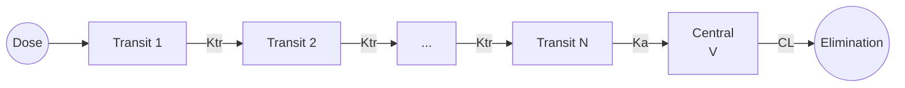

# Transit Compartment Absorption

Transit compartment model for delayed and complex oral absorption, using a chain of compartments to represent gastrointestinal transit.

---

## Model Overview



### Clinical Applications

- Controlled-release formulations
- Enteric-coated tablets
- Drugs with gastric emptying delays
- Complex GI transit
- When simple lag time is insufficient
- Multiphasic absorption

### When to Use

| Use When | Don't Use When |
|----------|----------------|
| Delayed Tmax | Simple first-order works |
| Broad absorption peak | Sharp, early peak |
| Enteric coating | Immediate release |
| Complex GI transit | Simple lag time adequate |
| Gamma-like absorption | First-order sufficient |

---

## Mathematical Formulation

### Parameters

| Parameter | Symbol | Units | Description | Constraints |
|-----------|--------|-------|-------------|-------------|
| Transit compartments | N | - | Number of transit compartments | 1 ≤ N ≤ 20 |
| Transit rate | Ktr | 1/h | Transfer between transits | Ktr > 0 |
| Absorption rate | Ka | 1/h | Final absorption rate | Ka > 0 |
| Clearance | CL | L/h | Apparent clearance | CL > 0 |
| Volume | V | L | Apparent volume | V > 0 |

### State Variables

| State | Description |
|-------|-------------|
| Transit_1 ... Transit_N | Amount in each transit compartment |
| A_central | Amount in central compartment |

### Differential Equations

$$\frac{dT_1}{dt} = -K_{tr} \cdot T_1$$ (first transit, receives dose)

$$\frac{dT_i}{dt} = K_{tr} \cdot T_{i-1} - K_{tr} \cdot T_i$$ (for i = 2 to N)

$$\frac{dA_{central}}{dt} = K_a \cdot T_N - \frac{CL}{V} \cdot A_{central}$$

### Absorption Profile

The absorption input follows a gamma distribution:

$$\text{Input}(t) = \frac{D \cdot K_{tr}^{N+1} \cdot t^N \cdot e^{-K_{tr} \cdot t}}{N!}$$

### Observation

$$C = \frac{A_{central}}{V}$$

---

## Derived Parameters

### Mean Transit Time (MTT)

$$MTT = \frac{N + 1}{K_{tr}}$$

### Time to Maximum Input Rate

$$t_{max,input} = \frac{N}{K_{tr}}$$

### Absorption Variability

The coefficient of variation of the absorption profile:

$$CV_{absorption} = \frac{1}{\sqrt{N + 1}}$$

More transit compartments → narrower, more reproducible absorption.

---

## Julia API

### Type Definitions

```julia
# Model kind
struct TransitAbsorption <: ModelKind end

# Parameters
struct TransitAbsorptionParams <: AbstractParams
    N::Int         # Number of transit compartments
    Ktr::Float64   # Transit rate constant (1/h)
    Ka::Float64    # Absorption rate constant (1/h)
    CL::Float64    # Clearance (L/h)
    V::Float64     # Volume (L)
end
```

### Basic Simulation

```julia
using OpenPKPDCore

# Define parameters
# 5 transit compartments, Ktr = 0.5/h
# MTT = (5+1)/0.5 = 12 hours
params = TransitAbsorptionParams(5, 0.5, 2.0, 10.0, 70.0)

# Single 300 mg oral dose
doses = [DoseEvent(0.0, 300.0)]

# Create specification
spec = ModelSpec(
    TransitAbsorption(),
    "transit_example",
    params,
    doses
)

# Time grid
grid = SimGrid(0.0, 48.0, collect(0.0:0.25:48.0))

# Solver
solver = SolverSpec(:Tsit5, 1e-10, 1e-12, 10_000_000)

# Run simulation
result = simulate(spec, grid, solver)

# Find Cmax and Tmax
conc = result.observations[:conc]
t = result.t
cmax, idx = findmax(conc)
tmax = t[idx]

println("Cmax: ", round(cmax, digits=2), " mg/L")
println("Tmax: ", round(tmax, digits=2), " h")

# Compare to MTT
MTT = (params.N + 1) / params.Ktr
println("Mean Transit Time: ", MTT, " h")
```

### Effect of Number of Transit Compartments

```julia
# Compare different N values
n_values = [1, 3, 5, 10]

for n in n_values
    # Keep MTT constant at 12 hours
    MTT = 12.0
    ktr = (n + 1) / MTT

    params = TransitAbsorptionParams(n, ktr, 2.0, 10.0, 70.0)
    doses = [DoseEvent(0.0, 300.0)]
    spec = ModelSpec(TransitAbsorption(), "n_$n", params, doses)
    grid = SimGrid(0.0, 48.0, collect(0.0:0.1:48.0))

    result = simulate(spec, grid, solver)
    conc = result.observations[:conc]
    cmax, idx = findmax(conc)
    tmax = result.t[idx]

    println("N=$n: Cmax=$(round(cmax, digits=2)), Tmax=$(round(tmax, digits=2))")
end
```

**Expected Results:**
- Higher N → More delayed Tmax
- Higher N → Lower, broader Cmax
- Same AUC regardless of N (same CL)

---

## Comparison with Simple Oral

```julia
# Transit absorption
params_transit = TransitAbsorptionParams(5, 0.5, 2.0, 10.0, 70.0)

# Simple first-order with lag
# Approximate effective Ka from transit
effective_ka = 0.3  # Slower overall absorption

params_simple = OneCompOralFirstOrderParams(effective_ka, 10.0, 70.0)

doses = [DoseEvent(0.0, 300.0)]
grid = SimGrid(0.0, 48.0, collect(0.0:0.1:48.0))

spec_transit = ModelSpec(TransitAbsorption(), "transit", params_transit, doses)
spec_simple = ModelSpec(OneCompOralFirstOrder(), "simple", params_simple, doses)

result_transit = simulate(spec_transit, grid, solver)
result_simple = simulate(spec_simple, grid, solver)

# Transit model has:
# - Delayed onset
# - Broader peak
# - More physiological shape
```

---

## Controlled-Release Formulation

```julia
# Extended-release tablet
# Long MTT (18 hours), slow release
params_er = TransitAbsorptionParams(8, 0.5, 0.5, 10.0, 70.0)

# Immediate-release for comparison
params_ir = OneCompOralFirstOrderParams(2.0, 10.0, 70.0)

# Same total daily dose, ER given once, IR given TID
doses_er = [DoseEvent(0.0, 300.0)]
doses_ir = [DoseEvent(0.0, 100.0), DoseEvent(8.0, 100.0), DoseEvent(16.0, 100.0)]

grid = SimGrid(0.0, 48.0, collect(0.0:0.25:48.0))

spec_er = ModelSpec(TransitAbsorption(), "ER", params_er, doses_er)
spec_ir = ModelSpec(OneCompOralFirstOrder(), "IR", params_ir, doses_ir)

result_er = simulate(spec_er, grid, solver)
result_ir = simulate(spec_ir, grid, solver)

# ER has:
# - Lower Cmax
# - More sustained levels
# - Better compliance (once daily)
```

---

## Population Simulation

```julia
# Typical parameters
typical_params = TransitAbsorptionParams(5, 0.5, 2.0, 10.0, 70.0)

# Note: N is typically fixed, not random
# IIV on Ktr, Ka, CL, V
omega = OmegaMatrix([
    0.25 0.0  0.0  0.0;    # ω²_Ktr (50% CV - high for transit)
    0.0  0.16 0.0  0.0;    # ω²_Ka (40% CV)
    0.0  0.0  0.09 0.0;    # ω²_CL (30% CV)
    0.0  0.0  0.0  0.04    # ω²_V (20% CV)
])

doses = [DoseEvent(0.0, 300.0)]
base_spec = ModelSpec(TransitAbsorption(), "pop", typical_params, doses)

pop_spec = PopulationSpec(base_spec, 100, omega, 12345)

grid = SimGrid(0.0, 48.0, collect(0.0:0.5:48.0))
result = simulate_population(pop_spec, grid, solver)

# High variability in Tmax due to Ktr IIV
tmax_values = Float64[]
for ind in result.individuals
    conc = ind.observations[:conc]
    _, idx = findmax(conc)
    push!(tmax_values, ind.t[idx])
end

using Statistics
println("Tmax median: ", median(tmax_values), " h")
println("Tmax range: ", minimum(tmax_values), " - ", maximum(tmax_values), " h")
```

---

## Estimation Considerations

### Identifiability

- N and Ktr are correlated (same MTT with different combinations)
- Often fix N based on physiology or prior knowledge
- Estimate Ktr (or MTT) with N fixed

### Starting Values

```julia
# From observed Tmax, estimate MTT
observed_tmax = 8.0  # hours

# MTT ≈ Tmax for transit models
# Choose N based on formulation (3-7 typical)
N_guess = 5
Ktr_guess = (N_guess + 1) / observed_tmax

println("Initial Ktr: ", Ktr_guess, " 1/h")
```

---

## Equations Summary

| Quantity | Formula |
|----------|---------|
| MTT | $(N+1)/K_{tr}$ |
| t_max,input | $N/K_{tr}$ |
| CV_absorption | $1/\sqrt{N+1}$ |
| Input rate | $\frac{D \cdot K_{tr}^{N+1} \cdot t^N \cdot e^{-K_{tr}t}}{N!}$ |
| dT_1/dt | $-K_{tr} \cdot T_1$ |
| dT_i/dt | $K_{tr}(T_{i-1} - T_i)$ |
| dA/dt | $K_a T_N - (CL/V) A$ |

---

## See Also

- [One-Compartment Oral](onecomp-oral.md) - Simple absorption
- [Two-Compartment Oral](twocomp-oral.md) - With distribution
- [NCA Reference](../../nca/index.md) - Exposure calculations
- [Population Modeling](../../population/index.md) - Adding variability
