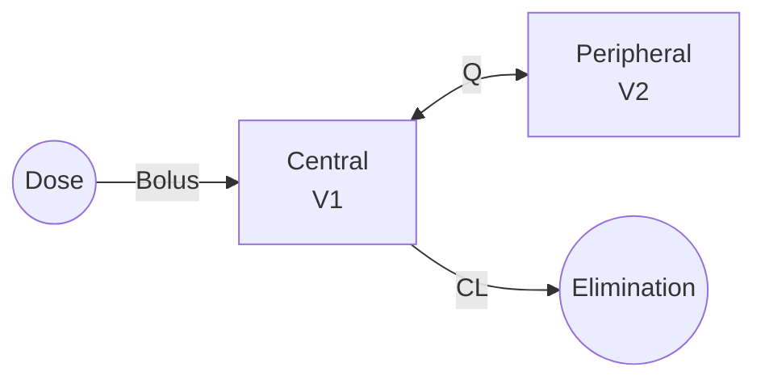

# Two-Compartment IV Bolus

Two-compartment mammillary model with central and peripheral compartments, exhibiting bi-exponential concentration decline after IV bolus administration.

---

## Model Overview



### Clinical Applications

- Drugs with distribution phase
- Lipophilic compounds
- Antibodies and biologics
- Anesthetics
- Drugs with tissue binding

### When to Use

| Use When | Don't Use When |
|----------|----------------|
| Bi-exponential decline | Mono-exponential decline |
| Clear distribution phase | Rapid equilibration |
| Multi-tissue distribution | Single compartment kinetics |
| α and β phases visible | Tri-exponential needed |

---

## Mathematical Formulation

### Parameters

| Parameter | Symbol | Units | Description | Constraints |
|-----------|--------|-------|-------------|-------------|
| Clearance | CL | L/h | Systemic clearance | CL > 0 |
| Central volume | V1 | L | Volume of central compartment | V1 > 0 |
| Inter-compartmental clearance | Q | L/h | Distribution clearance | Q > 0 |
| Peripheral volume | V2 | L | Volume of peripheral compartment | V2 > 0 |

### Micro-Rate Constants

$$k_{10} = \frac{CL}{V_1}$$ (elimination)

$$k_{12} = \frac{Q}{V_1}$$ (central → peripheral)

$$k_{21} = \frac{Q}{V_2}$$ (peripheral → central)

### State Variables

| State | Symbol | Units | Description |
|-------|--------|-------|-------------|
| Central amount | A1 | mg | Drug in central compartment |
| Peripheral amount | A2 | mg | Drug in peripheral compartment |

### Differential Equations

$$\frac{dA_1}{dt} = -k_{10} \cdot A_1 - k_{12} \cdot A_1 + k_{21} \cdot A_2$$

$$\frac{dA_2}{dt} = k_{12} \cdot A_1 - k_{21} \cdot A_2$$

### Bi-Exponential Solution

$$C(t) = A \cdot e^{-\alpha t} + B \cdot e^{-\beta t}$$

Where:
- α = fast (distribution) rate constant
- β = slow (elimination) rate constant
- A, B = coefficients (macro-constants)

### Hybrid Constants

$$\alpha + \beta = k_{10} + k_{12} + k_{21}$$

$$\alpha \cdot \beta = k_{10} \cdot k_{21}$$

### Observation

$$C = \frac{A_1}{V_1}$$

---

## Derived Parameters

### Distribution and Elimination Rates

$$\alpha = \frac{1}{2}\left[(k_{10} + k_{12} + k_{21}) + \sqrt{(k_{10} + k_{12} + k_{21})^2 - 4 \cdot k_{10} \cdot k_{21}}\right]$$

$$\beta = \frac{1}{2}\left[(k_{10} + k_{12} + k_{21}) - \sqrt{(k_{10} + k_{12} + k_{21})^2 - 4 \cdot k_{10} \cdot k_{21}}\right]$$

### Half-Lives

$$t_{1/2,\alpha} = \frac{0.693}{\alpha}$$ (distribution half-life)

$$t_{1/2,\beta} = \frac{0.693}{\beta}$$ (terminal half-life)

### Coefficients

$$A = \frac{D}{V_1} \cdot \frac{\alpha - k_{21}}{\alpha - \beta}$$

$$B = \frac{D}{V_1} \cdot \frac{k_{21} - \beta}{\alpha - \beta}$$

### Volume at Steady State

$$V_{ss} = V_1 + V_2 = V_1 \cdot \left(1 + \frac{k_{12}}{k_{21}}\right)$$

### AUC

$$AUC = \frac{A}{\alpha} + \frac{B}{\beta} = \frac{D}{CL}$$

---

## Julia API

### Type Definitions

```julia
# Model kind
struct TwoCompIVBolus <: ModelKind end

# Parameters
struct TwoCompIVBolusParams <: AbstractParams
    CL::Float64    # Clearance (L/h)
    V1::Float64    # Central volume (L)
    Q::Float64     # Inter-compartmental clearance (L/h)
    V2::Float64    # Peripheral volume (L)
end
```

### Basic Simulation

```julia
using NeoPKPD

# Define parameters
# CL = 10 L/h, V1 = 20 L
# Q = 15 L/h, V2 = 50 L
params = TwoCompIVBolusParams(10.0, 20.0, 15.0, 50.0)

# Single 500 mg IV bolus
doses = [DoseEvent(0.0, 500.0)]

# Create specification
spec = ModelSpec(
    TwoCompIVBolus(),
    "twocomp_example",
    params,
    doses
)

# Fine time grid to capture distribution phase
grid = SimGrid(0.0, 48.0, collect(0.0:0.1:48.0))

# Solver
solver = SolverSpec(:Tsit5, 1e-10, 1e-12, 10_000_000)

# Run simulation
result = simulate(spec, grid, solver)

# Observe bi-exponential decline
conc = result.observations[:conc]
println("C at t=0: ", round(conc[1], digits=2), " mg/L")
println("C at t=1h: ", round(conc[11], digits=2), " mg/L (distribution)")
println("C at t=24h: ", round(conc[241], digits=2), " mg/L (terminal)")
```

### Calculate Derived Parameters

```julia
# Micro-rate constants
k10 = params.CL / params.V1
k12 = params.Q / params.V1
k21 = params.Q / params.V2

# Alpha and beta
sum_k = k10 + k12 + k21
prod_k = k10 * k21
discriminant = sqrt(sum_k^2 - 4*prod_k)

alpha = (sum_k + discriminant) / 2
beta = (sum_k - discriminant) / 2

# Half-lives
t_half_alpha = log(2) / alpha
t_half_beta = log(2) / beta

println("Distribution t½: ", round(t_half_alpha, digits=2), " h")
println("Terminal t½: ", round(t_half_beta, digits=2), " h")

# Vss
Vss = params.V1 + params.V2
println("Vss: ", Vss, " L")
```

### Distribution Phase Analysis

```julia
# Identify distribution vs elimination phases
conc = result.observations[:conc]
t = result.t

# Log-transform for visual inspection
log_conc = log.(conc)

# Find inflection point (approximate end of distribution)
# Where second derivative changes sign
diff1 = diff(log_conc)
diff2 = diff(diff1)

# Transition occurs where distribution phase ends
# Typically when |dC/dt| stabilizes
```

---

## Clinical Example: Vancomycin

```julia
# Vancomycin typical parameters
# CL ≈ 4.5 L/h, V1 ≈ 15 L, Q ≈ 4 L/h, V2 ≈ 40 L
params = TwoCompIVBolusParams(4.5, 15.0, 4.0, 40.0)

# 1g over 1 hour (infusion)
doses = [DoseEvent(0.0, 1000.0, 1.0)]

spec = ModelSpec(TwoCompIVBolus(), "vancomycin", params, doses)
grid = SimGrid(0.0, 24.0, collect(0.0:0.25:24.0))

result = simulate(spec, grid, solver)

# Therapeutic monitoring
# Target peak (2h post-start): 30-40 mg/L
# Target trough: 15-20 mg/L
idx_2h = findfirst(x -> x ≈ 2.0, result.t)
idx_24h = findfirst(x -> x ≈ 24.0, result.t)

println("Peak (2h): ", round(result.observations[:conc][idx_2h], digits=1), " mg/L")
println("Trough (24h): ", round(result.observations[:conc][idx_24h], digits=1), " mg/L")
```

---

## Population Simulation

```julia
# Typical parameters
typical_params = TwoCompIVBolusParams(10.0, 20.0, 15.0, 50.0)

# IIV on all parameters
# 30% CV on CL, 25% CV on V1, 35% CV on Q, 30% CV on V2
omega = OmegaMatrix([
    0.09 0.0  0.0  0.0;    # ω²_CL
    0.0  0.0625 0.0 0.0;   # ω²_V1
    0.0  0.0  0.1225 0.0;  # ω²_Q
    0.0  0.0  0.0  0.09    # ω²_V2
])

doses = [DoseEvent(0.0, 500.0)]
base_spec = ModelSpec(TwoCompIVBolus(), "pop", typical_params, doses)

pop_spec = PopulationSpec(base_spec, 100, omega, 12345)

grid = SimGrid(0.0, 48.0, collect(0.0:1.0:48.0))
result = simulate_population(pop_spec, grid, solver)

# Summary statistics
summary = result.summaries[:conc]
println("Median at 24h: ", summary.median[25])
```

---

## Comparison with One-Compartment

```julia
# Same total volume and clearance
CL = 10.0
Vtotal = 70.0

# One-compartment
params_1comp = OneCompIVBolusParams(CL, Vtotal)

# Two-compartment (same Vss)
params_2comp = TwoCompIVBolusParams(CL, 20.0, 15.0, 50.0)

doses = [DoseEvent(0.0, 500.0)]
grid = SimGrid(0.0, 48.0, collect(0.0:0.1:48.0))

# Simulate both
spec_1comp = ModelSpec(OneCompIVBolus(), "1comp", params_1comp, doses)
spec_2comp = ModelSpec(TwoCompIVBolus(), "2comp", params_2comp, doses)

result_1comp = simulate(spec_1comp, grid, solver)
result_2comp = simulate(spec_2comp, grid, solver)

# Two-comp has:
# - Higher initial concentration
# - Faster initial decline
# - Same terminal AUC
```

---

## Equations Summary

| Quantity | Formula |
|----------|---------|
| k10 | $CL/V_1$ |
| k12 | $Q/V_1$ |
| k21 | $Q/V_2$ |
| α | $\frac{1}{2}[(k_{10}+k_{12}+k_{21}) + \sqrt{\Delta}]$ |
| β | $\frac{1}{2}[(k_{10}+k_{12}+k_{21}) - \sqrt{\Delta}]$ |
| C(t) | $A \cdot e^{-\alpha t} + B \cdot e^{-\beta t}$ |
| Vss | $V_1 + V_2$ |
| Terminal t½ | $0.693/\beta$ |

---

## See Also

- [One-Compartment IV Bolus](onecomp-iv-bolus.md) - Simpler model
- [Two-Compartment Oral](twocomp-oral.md) - With absorption
- [Three-Compartment IV](threecomp-iv.md) - For deep tissue binding
- [Population Modeling](../../population/index.md) - Adding variability
