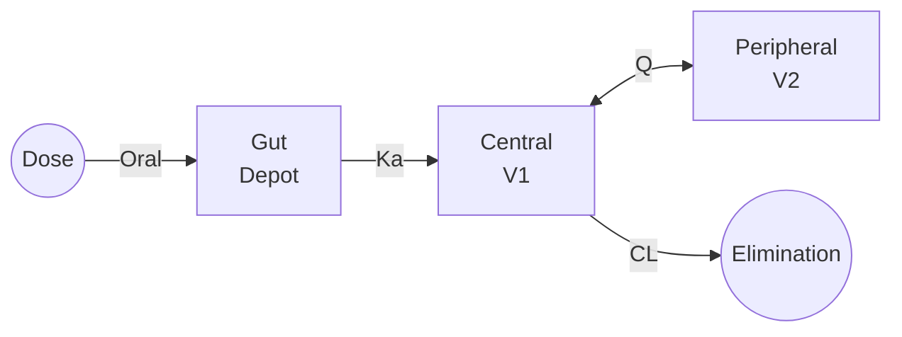

# Two-Compartment Oral

Two-compartment model with first-order oral absorption, combining absorption kinetics with distribution between central and peripheral compartments.

---

## Model Overview



### Clinical Applications

- Oral drugs with tissue distribution
- Extended-release formulations
- Lipophilic oral compounds
- Drugs with enterohepatic recirculation (simplified)
- Biologics with oral absorption

### When to Use

| Use When | Don't Use When |
|----------|----------------|
| Oral with bi-exponential decline | Simple mono-exponential |
| Distribution phase evident | Rapid equilibration |
| Complex tissue binding | IV-only administration |
| Multi-phase elimination | Simple first-pass kinetics |

---

## Mathematical Formulation

### Parameters

| Parameter | Symbol | Units | Description | Constraints |
|-----------|--------|-------|-------------|-------------|
| Absorption rate | Ka | 1/h | First-order absorption | Ka > 0 |
| Clearance | CL | L/h | Apparent clearance (CL/F) | CL > 0 |
| Central volume | V1 | L | Central compartment (V1/F) | V1 > 0 |
| Inter-compartmental clearance | Q | L/h | Distribution clearance (Q/F) | Q > 0 |
| Peripheral volume | V2 | L | Peripheral compartment (V2/F) | V2 > 0 |

### State Variables

| State | Symbol | Units | Description |
|-------|--------|-------|-------------|
| Gut amount | A_gut | mg | Drug in absorption depot |
| Central amount | A1 | mg | Drug in central compartment |
| Peripheral amount | A2 | mg | Drug in peripheral compartment |

### Differential Equations

$$\frac{dA_{gut}}{dt} = -K_a \cdot A_{gut}$$

$$\frac{dA_1}{dt} = K_a \cdot A_{gut} - \frac{CL}{V_1} \cdot A_1 - \frac{Q}{V_1} \cdot A_1 + \frac{Q}{V_2} \cdot A_2$$

$$\frac{dA_2}{dt} = \frac{Q}{V_1} \cdot A_1 - \frac{Q}{V_2} \cdot A_2$$

### Observation

$$C = \frac{A_1}{V_1}$$

---

## Derived Parameters

### Micro-Rate Constants

$$k_a = K_a$$

$$k_{10} = \frac{CL}{V_1}$$

$$k_{12} = \frac{Q}{V_1}$$

$$k_{21} = \frac{Q}{V_2}$$

### Hybrid Constants (α, β)

Same as two-compartment IV:

$$\alpha, \beta = \frac{1}{2}\left[(k_{10} + k_{12} + k_{21}) \pm \sqrt{(k_{10} + k_{12} + k_{21})^2 - 4k_{10}k_{21}}\right]$$

### Half-Lives

- **Absorption**: $t_{1/2,a} = 0.693/K_a$
- **Distribution**: $t_{1/2,\alpha} = 0.693/\alpha$
- **Terminal**: $t_{1/2,\beta} = 0.693/\beta$

### Tmax

No simple closed-form solution exists. Tmax is determined numerically when:

$$\frac{dC}{dt} = 0$$

---

## Julia API

### Type Definitions

```julia
# Model kind
struct TwoCompOral <: ModelKind end

# Parameters
struct TwoCompOralParams <: AbstractParams
    Ka::Float64    # Absorption rate constant (1/h)
    CL::Float64    # Clearance (L/h)
    V1::Float64    # Central volume (L)
    Q::Float64     # Inter-compartmental clearance (L/h)
    V2::Float64    # Peripheral volume (L)
end
```

### Basic Simulation

```julia
using OpenPKPDCore

# Define parameters
# Ka = 1.2/h, CL = 8 L/h, V1 = 25 L, Q = 12 L/h, V2 = 60 L
params = TwoCompOralParams(1.2, 8.0, 25.0, 12.0, 60.0)

# Single 400 mg oral dose
doses = [DoseEvent(0.0, 400.0)]

# Create specification
spec = ModelSpec(
    TwoCompOral(),
    "twocomp_oral_example",
    params,
    doses
)

# Time grid
grid = SimGrid(0.0, 72.0, collect(0.0:0.25:72.0))

# Solver
solver = SolverSpec(:Tsit5, 1e-10, 1e-12, 10_000_000)

# Run simulation
result = simulate(spec, grid, solver)

# Find Cmax and Tmax
conc = result.observations[:conc]
t = result.t
cmax, idx = findmax(conc)
tmax = t[idx]

println("Cmax: ", round(cmax, digits=2), " mg/L")
println("Tmax: ", round(tmax, digits=2), " h")
```

### Multiple Dosing to Steady State

```julia
# 400 mg every 12 hours
doses = DoseEvent[]
for i in 0:13  # 7 days
    push!(doses, DoseEvent(i * 12.0, 400.0))
end

spec = ModelSpec(TwoCompOral(), "bid_7days", params, doses)
grid = SimGrid(0.0, 168.0, collect(0.0:0.5:168.0))

result = simulate(spec, grid, solver)

# Steady-state metrics (last dosing interval)
conc = result.observations[:conc]
t = result.t

# Find Cmax,ss and Cmin,ss in last interval (156-168 h)
ss_start = findfirst(x -> x >= 156.0, t)
ss_end = findfirst(x -> x >= 168.0, t)

cmax_ss = maximum(conc[ss_start:ss_end])
cmin_ss = minimum(conc[ss_start:ss_end])

println("Steady-state Cmax: ", round(cmax_ss, digits=2), " mg/L")
println("Steady-state Cmin: ", round(cmin_ss, digits=2), " mg/L")
```

---

## Absorption Rate Effects

```julia
# Compare different absorption rates
ka_values = [0.5, 1.0, 2.0, 4.0]

for ka in ka_values
    params = TwoCompOralParams(ka, 8.0, 25.0, 12.0, 60.0)
    doses = [DoseEvent(0.0, 400.0)]
    spec = ModelSpec(TwoCompOral(), "ka_$ka", params, doses)
    grid = SimGrid(0.0, 24.0, collect(0.0:0.1:24.0))

    result = simulate(spec, grid, solver)
    conc = result.observations[:conc]
    cmax, idx = findmax(conc)
    tmax = result.t[idx]

    println("Ka = $ka: Cmax = $(round(cmax, digits=2)), Tmax = $(round(tmax, digits=2))")
end
```

**Expected Results:**
- Higher Ka → Earlier Tmax, Higher Cmax
- Lower Ka → Later Tmax, Lower Cmax
- AUC remains constant (depends on CL, not Ka)

---

## Population Simulation

```julia
# Typical parameters
typical_params = TwoCompOralParams(1.2, 8.0, 25.0, 12.0, 60.0)

# IIV: High variability on Ka (50% CV), moderate on others
omega = OmegaMatrix([
    0.25 0.0  0.0  0.0  0.0;   # ω²_Ka (50% CV)
    0.0  0.09 0.0  0.0  0.0;   # ω²_CL (30% CV)
    0.0  0.0  0.04 0.0  0.0;   # ω²_V1 (20% CV)
    0.0  0.0  0.0  0.09 0.0;   # ω²_Q  (30% CV)
    0.0  0.0  0.0  0.0  0.04   # ω²_V2 (20% CV)
])

doses = [DoseEvent(0.0, 400.0)]
base_spec = ModelSpec(TwoCompOral(), "pop", typical_params, doses)

pop_spec = PopulationSpec(base_spec, 100, omega, 12345)

grid = SimGrid(0.0, 48.0, collect(0.0:0.5:48.0))
result = simulate_population(pop_spec, grid, solver)

# Summarize Cmax and Tmax variability
cmax_values = Float64[]
tmax_values = Float64[]

for ind in result.individuals
    conc = ind.observations[:conc]
    t = ind.t
    cmax, idx = findmax(conc)
    push!(cmax_values, cmax)
    push!(tmax_values, t[idx])
end

using Statistics
println("Cmax: ", round(mean(cmax_values), digits=2),
        " (CV: ", round(100*std(cmax_values)/mean(cmax_values), digits=1), "%)")
println("Tmax: ", round(median(tmax_values), digits=2),
        " h (range: ", round(minimum(tmax_values), digits=1), "-",
        round(maximum(tmax_values), digits=1), ")")
```

---

## Food Effect Study Design

```julia
# Fasted state: Fast absorption
params_fasted = TwoCompOralParams(2.0, 8.0, 25.0, 12.0, 60.0)

# Fed state: Slower absorption, possibly enhanced bioavailability
# If F increases by 25%, apparent CL decreases
params_fed = TwoCompOralParams(0.8, 6.4, 25.0, 12.0, 60.0)

doses = [DoseEvent(0.0, 400.0)]
grid = SimGrid(0.0, 48.0, collect(0.0:0.25:48.0))

spec_fasted = ModelSpec(TwoCompOral(), "fasted", params_fasted, doses)
spec_fed = ModelSpec(TwoCompOral(), "fed", params_fed, doses)

result_fasted = simulate(spec_fasted, grid, solver)
result_fed = simulate(spec_fed, grid, solver)

# Compare exposure
auc_fasted = sum(result_fasted.observations[:conc]) * 0.25  # Approximate AUC
auc_fed = sum(result_fed.observations[:conc]) * 0.25

cmax_fasted = maximum(result_fasted.observations[:conc])
cmax_fed = maximum(result_fed.observations[:conc])

println("Fed/Fasted AUC ratio: ", round(auc_fed/auc_fasted, digits=2))
println("Fed/Fasted Cmax ratio: ", round(cmax_fed/cmax_fasted, digits=2))
```

---

## Comparison with One-Compartment Oral

```julia
# Same total apparent volume and clearance
# Two-comp oral
params_2comp = TwoCompOralParams(1.2, 8.0, 25.0, 12.0, 60.0)

# One-comp oral (same AUC)
params_1comp = OneCompOralFirstOrderParams(1.2, 8.0, 85.0)  # V = V1 + V2

doses = [DoseEvent(0.0, 400.0)]
grid = SimGrid(0.0, 48.0, collect(0.0:0.1:48.0))

spec_2comp = ModelSpec(TwoCompOral(), "2comp", params_2comp, doses)
spec_1comp = ModelSpec(OneCompOralFirstOrder(), "1comp", params_1comp, doses)

result_2comp = simulate(spec_2comp, grid, solver)
result_1comp = simulate(spec_1comp, grid, solver)

# Key differences:
# - 2-comp has higher initial peak (smaller V1)
# - 2-comp has secondary distribution phase
# - Both have same terminal AUC
```

---

## Equations Summary

| Quantity | Formula |
|----------|---------|
| dA_gut/dt | $-K_a \cdot A_{gut}$ |
| dA1/dt | $K_a A_{gut} - (k_{10} + k_{12})A_1 + k_{21}A_2$ |
| dA2/dt | $k_{12}A_1 - k_{21}A_2$ |
| C(t) | $A_1(t)/V_1$ |
| AUC | $D/CL$ |
| Absorption t½ | $0.693/K_a$ |
| Terminal t½ | $0.693/\beta$ |

---

## See Also

- [One-Compartment Oral](onecomp-oral.md) - Simpler model
- [Two-Compartment IV](twocomp-iv.md) - Without absorption
- [Transit Absorption](transit-absorption.md) - Complex absorption
- [NCA Reference](../../nca/index.md) - Exposure calculations
