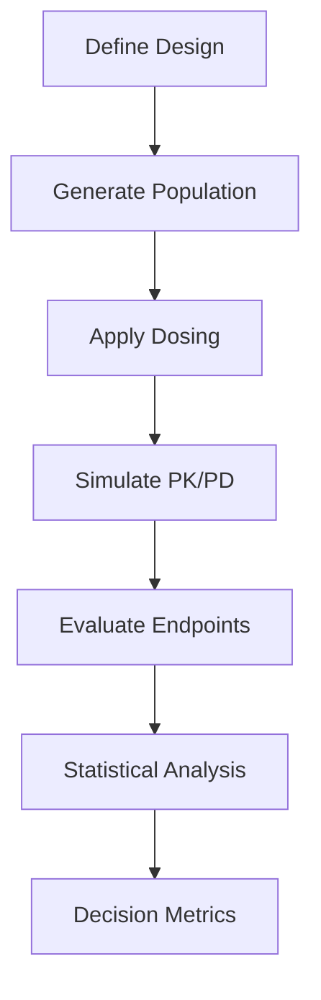

# Clinical Trial Simulation

NeoPKPD provides comprehensive clinical trial simulation capabilities for study design, power analysis, and decision-making.

---

## Overview

Clinical trial simulation enables:

- Virtual trial execution before enrollment
- Power and sample size estimation
- Study design optimization
- Risk assessment and mitigation



---

## Trial Types

<div class="grid cards" markdown>

-   :material-arrow-split-vertical:{ .lg .middle } **Parallel Design**

    ---

    Independent treatment groups

    [:octicons-arrow-right-24: Parallel](parallel.md)

-   :material-swap-horizontal:{ .lg .middle } **Crossover Design**

    ---

    Within-subject comparisons

    [:octicons-arrow-right-24: Crossover](crossover.md)

-   :material-stairs-up:{ .lg .middle } **Dose Escalation**

    ---

    3+3, mTPI, CRM designs

    [:octicons-arrow-right-24: Escalation](dose-escalation.md)

-   :material-chart-line:{ .lg .middle } **Power Analysis**

    ---

    Sample size and power estimation

    [:octicons-arrow-right-24: Power](power.md)

</div>

---

## Quick Start

### Parallel Design

```julia
using NeoPKPDCore

# Define trial design
design = ParallelDesign(
    n_arms = 3,
    arm_names = ["Placebo", "Low Dose", "High Dose"],
    randomization_ratio = [1, 1, 1]
)

# Define dosing regimens
regimens = [
    DosingRegimen(0.0, 28, 24.0),      # Placebo
    DosingRegimen(50.0, 28, 24.0),     # 50 mg QD
    DosingRegimen(100.0, 28, 24.0)     # 100 mg QD
]

# Generate virtual population
population = generate_population(
    n = 150,                           # Total subjects
    spec = HealthyVolunteerSpec(),
    seed = 42
)

# Define trial specification
trial = TrialSpec(
    name = "Phase 2 Dose Finding",
    design = design,
    regimens = regimens,
    population = population,
    pk_model = OneCompIVBolus(),
    pk_params = OneCompIVBolusParams(5.0, 50.0),
    omega = OmegaMatrix([0.09 0.0; 0.0 0.04])
)

# Run simulation
result = simulate_trial(trial, seed = 12345)

# Analyze results
for arm in result.arms
    println("$(arm.name): n=$(arm.n_completed), mean_auc=$(arm.mean_auc)")
end
```

### Crossover Design

```julia
# 2×2 crossover
design = CrossoverDesign(
    n_periods = 2,
    n_sequences = 2,
    sequences = [["A", "B"], ["B", "A"]],
    washout_days = 14
)

# Generate balanced population
population = generate_population(
    n = 24,                            # 12 per sequence
    spec = HealthyVolunteerSpec(),
    seed = 42
)

trial = TrialSpec(
    name = "BE Crossover",
    design = design,
    population = population,
    ...
)

result = simulate_trial(trial, seed = 12345)
```

---

## Population Generation

### Demographics

```julia
# Healthy volunteer specification
spec = DemographicSpec(
    age_mean = 35.0,
    age_sd = 10.0,
    age_min = 18.0,
    age_max = 55.0,
    weight_mean = 75.0,
    weight_sd = 12.0,
    weight_min = 50.0,
    weight_max = 100.0,
    female_fraction = 0.5,
    race_distribution = Dict(
        "white" => 0.7,
        "black" => 0.15,
        "asian" => 0.10,
        "other" => 0.05
    )
)

pop = generate_population(n = 100, spec = spec, seed = 42)
```

### Patient Population

```julia
# Renal impairment study
spec = DemographicSpec(
    age_mean = 65.0,
    age_sd = 12.0,
    age_min = 18.0,
    age_max = 85.0,
    egfr_distribution = Dict(
        "normal" => 0.0,           # eGFR ≥ 90
        "mild" => 0.33,            # eGFR 60-89
        "moderate" => 0.34,        # eGFR 30-59
        "severe" => 0.33           # eGFR 15-29
    )
)
```

---

## Dosing Regimens

```julia
# Once daily
regimen = dosing_qd(dose = 100.0, days = 28)

# Twice daily
regimen = dosing_bid(dose = 50.0, days = 14)

# Custom schedule
regimen = DosingRegimen(
    doses = [100.0, 100.0, 100.0],
    times = [0.0, 8.0, 16.0],
    repeat_days = 7
)

# Titration
regimen = TitrationRegimen(
    start_dose = 25.0,
    target_dose = 100.0,
    steps = [25, 50, 75, 100],
    days_per_step = 7
)
```

---

## Power Analysis

### Analytical Power

```julia
# Calculate power for given sample size
power = estimate_power(
    n_per_arm = 50,
    effect_size = 0.5,          # Cohen's d
    sd = 1.0,
    alpha = 0.05,
    test = :two_sample_t
)

println("Power: ", power.power)
println("Effect size: ", power.effect_size)
```

### Sample Size Estimation

```julia
# Find n for target power
result = estimate_sample_size(
    target_power = 0.80,
    effect_size = 0.5,
    sd = 1.0,
    alpha = 0.05
)

println("Required n per arm: ", result.n_per_arm)
println("Achieved power: ", result.achieved_power)
```

### Simulation-Based Power

```julia
# Power via simulation (more flexible)
power = estimate_power_simulation(
    trial_spec = trial,
    n_simulations = 1000,
    endpoint = :auc_comparison,
    success_criterion = auc_diff -> auc_diff > 0 && pvalue < 0.05,
    seed = 42
)

println("Simulated power: ", power.power)
println("95% CI: ", power.ci)
```

---

## Statistical Analysis

### Arm Comparison

```julia
# Compare treatment to control
comparison = compare_arms(
    treatment = result.arms["High Dose"].auc_values,
    control = result.arms["Placebo"].auc_values,
    test = :ttest
)

println("Difference: ", comparison.difference)
println("95% CI: ", comparison.ci)
println("p-value: ", comparison.pvalue)
```

### Bioequivalence Analysis

```julia
# 90% CI for geometric mean ratio
be_result = bioequivalence_analysis(
    test = result.arms["Test"].auc_values,
    reference = result.arms["Reference"].auc_values
)

println("GMR: ", be_result.gmr)
println("90% CI: ", be_result.ci_90)
println("BE conclusion: ", be_result.is_bioequivalent)
```

---

## Trial Result Structure

```julia
struct TrialResult
    # Design info
    name::String
    design::TrialDesign

    # Arm results
    arms::Dict{String, ArmResult}

    # Population summary
    n_enrolled::Int
    n_completed::Int
    dropout_rate::Float64

    # Timing
    enrollment_duration::Float64
    study_duration::Float64
end

struct ArmResult
    name::String
    n_enrolled::Int
    n_completed::Int

    # PK endpoints
    auc_values::Vector{Float64}
    cmax_values::Vector{Float64}

    # Summary statistics
    mean_auc::Float64
    sd_auc::Float64
    cv_auc::Float64
end
```

---

## Next Steps

- [Parallel Design](parallel.md) - Detailed parallel trial guide
- [Crossover](crossover.md) - Crossover study design
- [Power Analysis](power.md) - Sample size determination
- [Python Trial Module](../../python/trial/index.md) - Python interface
