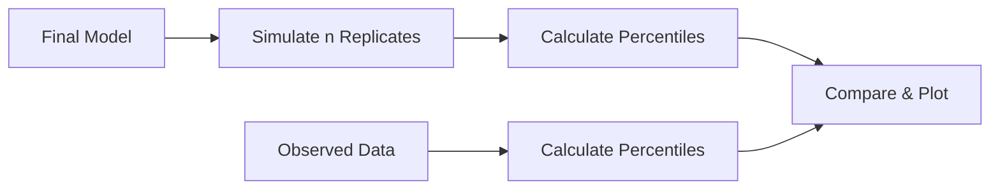

# Visual Predictive Check (VPC)

Visual Predictive Checks are essential diagnostic tools for validating population PK/PD models by comparing observed data to model predictions.

---

## Overview

VPC compares the distribution of observed data to simulations from the final model, assessing whether the model adequately captures:

- Central tendency (median)
- Variability (prediction intervals)
- Temporal patterns



---

## VPC Types

<div class="grid cards" markdown>

-   :material-chart-scatter-plot:{ .lg .middle } **Standard VPC**

    ---

    Basic VPC with observed vs simulated percentiles

    [:octicons-arrow-right-24: Standard VPC](standard.md)

-   :material-chart-timeline:{ .lg .middle } **Prediction-Corrected VPC**

    ---

    Corrects for design differences across bins

    [:octicons-arrow-right-24: pcVPC](pcvpc.md)

-   :material-view-split-vertical:{ .lg .middle } **Stratified VPC**

    ---

    Separate VPC by covariate strata

    [:octicons-arrow-right-24: Stratified](stratified.md)

</div>

---

## Quick Start

### Standard VPC

```julia
using NeoPKPDCore

# Observed data
observed = VPCData(
    times = [0.5, 1.0, 2.0, 4.0, 8.0, 12.0, 24.0],
    dv = [...],  # Observed concentrations
    ids = [...],
    strata = nothing
)

# Final model parameters
model_spec = ModelSpec(...)

# VPC configuration
config = VPCConfig(
    n_simulations = 1000,
    prediction_intervals = [0.05, 0.50, 0.95],
    bin_method = :jenks,          # Optimal binning
    bin_n = 8,                    # Number of bins
    seed = 12345
)

# Compute VPC
result = compute_vpc(observed, model_spec, config)

# Access results
println("Observed percentiles: ", result.observed_percentiles)
println("Simulated percentiles: ", result.simulated_percentiles)
println("Simulated CI: ", result.simulated_ci)
```

### Prediction-Corrected VPC

```julia
config = VPCConfig(
    n_simulations = 1000,
    prediction_intervals = [0.05, 0.50, 0.95],
    prediction_correction = true,  # Enable pcVPC
    bin_method = :jenks,
    seed = 12345
)

result = compute_vpc(observed, model_spec, config)
```

---

## VPC Components

### Observed Percentiles

Percentiles calculated from observed data within each time bin:

- **5th percentile**: Lower bound of variability
- **50th percentile**: Median (central tendency)
- **95th percentile**: Upper bound of variability

### Simulated Percentiles

For each simulation replicate, percentiles are calculated within bins, then the distribution of these percentiles provides:

- **Median of simulated percentiles**: Expected percentile
- **95% CI of simulated percentiles**: Prediction uncertainty

### Interpretation

| Observation | Interpretation |
|-------------|----------------|
| Observed within CI | Model adequate |
| Observed outside CI | Potential model misspecification |
| Systematic deviation | Structural model issue |
| Random deviation | May be sampling variability |

---

## Binning Strategies

### Available Methods

| Method | Description | Use Case |
|--------|-------------|----------|
| `:jenks` | Natural breaks optimization | Default, uneven sampling |
| `:equal_n` | Equal observations per bin | Sparse data |
| `:equal_width` | Equal time intervals | Dense, even sampling |
| `:manual` | User-specified boundaries | Custom requirements |

### Configuration

```julia
# Jenks natural breaks (default)
config = VPCConfig(bin_method = :jenks, bin_n = 8)

# Equal observations per bin
config = VPCConfig(bin_method = :equal_n, bin_n = 10)

# Manual bin boundaries
config = VPCConfig(
    bin_method = :manual,
    bin_boundaries = [0, 1, 2, 4, 8, 12, 24]
)
```

---

## VPC Result Structure

```julia
struct VPCResult
    # Binning
    bins::Vector{Tuple{Float64, Float64}}
    bin_midpoints::Vector{Float64}

    # Observed statistics
    observed_percentiles::Dict{Float64, Vector{Float64}}
    observed_n::Vector{Int}

    # Simulated statistics
    simulated_percentiles::Dict{Float64, Vector{Float64}}
    simulated_ci::Dict{Float64, Matrix{Float64}}

    # Configuration
    prediction_intervals::Vector{Float64}
    n_simulations::Int

    # Optional BLQ
    observed_blq_fraction::Vector{Float64}
    simulated_blq_fraction::Vector{Float64}
    simulated_blq_ci::Matrix{Float64}
end
```

---

## Stratified VPC

For models with covariates, stratify VPC by subgroups:

```julia
# Define strata
observed = VPCData(
    times = [...],
    dv = [...],
    ids = [...],
    strata = [:high_dose, :high_dose, :low_dose, ...]  # Covariate groups
)

config = VPCConfig(
    n_simulations = 1000,
    stratify_by = :strata
)

result = compute_vpc(observed, model_spec, config)

# Results are stratified
for stratum in unique(observed.strata)
    println("Stratum: ", stratum)
    println("  Observed median: ", result.observed_percentiles[stratum][0.50])
end
```

---

## BLQ Handling

Below Limit of Quantification observations require special handling:

```julia
config = VPCConfig(
    n_simulations = 1000,
    lloq = 0.1,                   # Lower limit of quantification
    blq_handling = :censor        # Censor BLQ observations
)

# Result includes BLQ fractions
println("Observed BLQ fraction: ", result.observed_blq_fraction)
println("Simulated BLQ fraction: ", result.simulated_blq_fraction)
```

---

## Next Steps

- [Standard VPC](standard.md) - Detailed standard VPC
- [pcVPC](pcvpc.md) - Prediction-corrected VPC
- [Stratified VPC](stratified.md) - Covariate stratification
- [Python Visualization](../../python/viz/vpc.md) - Plotting VPC results
